# Depths again. February, 2020

Following, some of my most recent letters. I will keep on uploading older and newer ones. 

Enjoy them!

## 2020-02-11 To B.
2020-02-11

8.36

Hello B,

I have confirmed my idea that letters are quite useful tools to know my mental state in different moments of the past. Currently, I am writing the story of A., my psycho, and I am using different texts to figure out how troubled my mind was due to her influence, which was quite a bit.

Thus, today, like any other day, it is a good moment to reflect on how my life and my mind is. After all, this is not a YouTube video where I have to say something inspiring or whatever, here I can delve and deepen a bit more in myself. (I think you haven’t written to me yet, by the way. Your problem, not mine).

So, I wake up about 20 minutes ago in the office. I stayed here last night because I was editing my 24 hours of social media experiment, and undoubtedly, it is better to do it with the bigger screen at the office and the laptop, than just with the laptop at home. Also, I wasn't really sleepy because I had drunk some coffee with soy milk, but I lied down with the 25-minutes power nap and light off because my eyes and brain were tired of looking at the screen all day. However, as it happens pretty much always, 25 min ended, and then I put 35, that became 1hour 30, that blablabla, suddenly I don’t care about my life anymore and I woke up on the floor when my most diligent colleagues are already in their offices.

And for the record, that is my face after waking up in the office:

```{r ofi, fig.cap= "Yes, I know I am pretty.", fig.margin = TRUE, out.width = "75%", fig.align='center', echo=FALSE}
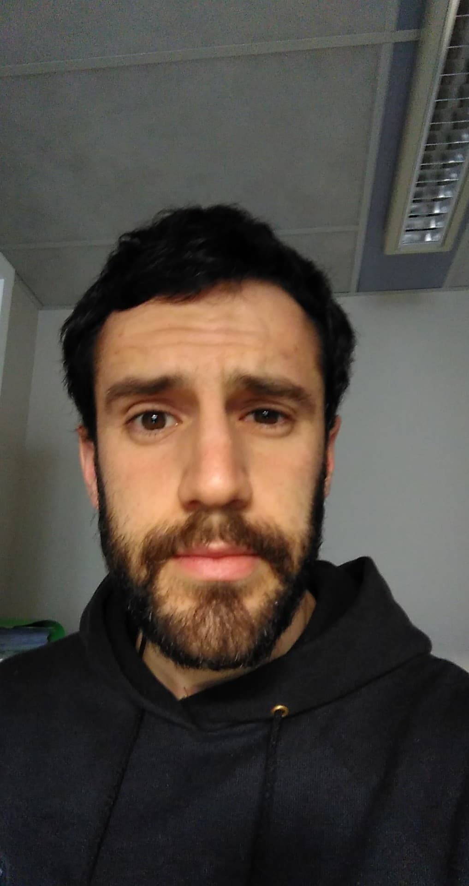
```

This is my life, as I told you in the Facebook conversation. Getting entertained with work, close to becoming an addict, and fighting my express depressions with whatever I can find. I have been recently in probably my worst period in Brussels. I was giving so many fucks that I wasn't taking care of myself the minimum amount, not even the least. For example, Saturday, after struggling with leaving home, I finally went to a café, making myself believe that I was going to work there, but in the last minute changed my plan, got into a bus, and read about the ills of civilization (Civilized to Death by Christopher Ryan). After an hour of public transport reading, I entered the café, write a half-page about my inability to carrying on with my life, and then struggle to put my brain in order again.

I have been masturbating more than ever, systematically skipping exercise, using meditation to fight back my thoughts and my loneliness, sporadically indulging in junk food and overeating sugar, spending almost full days in my bed, tapping the phone and reopening social media apps like a Pavlovian dog craving dopamine. Just because I have ADHD and this highly positive nature, it couldn't score clinically as a major depressive episode. I see a friendly colleague, and my social needs are supplied for the day. I exercise 15 minutes in the morning, and I felt that the morning was a success. I am able to write some pages about my story with A., and I have a feeling of accomplishment. Really, my standards have been lowered to unsuspected levels. I am in such deep shit, that taking one hand out of it and feeling the air on my palm feels as if I were clean.

I really need to go; I really need to disconnect from all this. I have been highly intoxicated by society, by life, by loneliness, by civilization. It may have been my fault, but I like to think that I have fucking tried. I have tried to find meaningful and not so meaningful relationships, but this city and this system feed by business, fluidity, and fear systematically distanced me from the people I loved, and avoid those that I could love, to even want to meet me. Numbers and statistics point out that I am not alone in my aloneness. Loneliness is an epidemic. Thanks to Ryan’s books (Sex at dawn and Civilized to death), I am entering in contact again with my bullied human nature. Air, water, food, and people. That’s all. People are highly necessary for my life, and I have lived without them. Spirituality and positive psychology are being swallowed by the system to become tools and mechanisms of keeping individuals inside the workings and gears of this machine. It is obvious that any type of consumption, from sugary and salty foods to entertainment in the form of series, movies, or music are strategies for keeping people distracted from their human lacks. This idea is not new, and I think I was already 16 when I was able to observe this reality. However, now it has become much more subtle and surreptitious, but much more obvious in my case. Things apparently well-intentioned, like meditation, positive thinking, and gratitude are being artificialized and used by the system to make us function in hostile environments. I thought about it when I was on the bike. The idea of keeping a gratitude journal is quite artificial. It is undeniable that it works, because in my case when I have practiced it, I was functioning better, and I could clearly observe the changes in my mood when I was skipping it. However, the fact that seems necessary to keep a gratitude journal with three to five situations or episodes a day would seem utterly ridiculous to a hunter-gatherer sapiens swallowed by a continuous life of social interactions of interdependence.

Similarly, with the idea of keeping positive thoughts, hope and optimism have been hijacked. The purpose of positive emotions is working extra hours in order to become successful, open your own business and make money. I mean, money for what? For realizing that you have become socially isolated after years of trading your hours of friendship into meaningless work?. It is a very dangerous cyclical process because once you are isolated, the only meaningful thing to keep you going is working more. I have experienced it myself. After the second time I have masturbated that day, and after five unfinished YouTube videos because none of them is rewarding enough the effort of sustaining my attention for 7 minutes, and the sleepiness insomnia of the thirds siesta, the pointless of going to the street to go nowhere, and the twentieth time of opening and closing the same three apps (WA, FB, IG) without getting any new messages; indeed, the best thing to do with one’s life is doing something pseudo-productive.

From time to time, with an encouraging message of any of my friends, I am able to put my shit together, and order my room, have a shower, and go dancing, or work in a standby project. But that is the thing of my brain, and the trap I am protecting myself from falling. It is so easy to self-punished myself, to think that I am making the wrong decision, because here I have the time and the space of working on myself, on stretching every day in my room, of training there, of working on my writing and video projects here in the office, while I am getting paid this high salary for doing a job that takes me one morning a week. And still, I haven’t been able to do it. I need people, I need people and I want to write it because this night while lying on the floor of my office I through that I may regret having left once I am in Zambia and things are not going as good as I expected. I need people. And here, I haven’t had people.

And this loneliness is dangerous. It is dangerous because it has made me highly vulnerable. Highly vulnerable to attacks from people like A., that could have deeply and seriously fucked up my life, not only economically and socially, but also morally and legally. Loneliness is an individual problem as much as a public one. Lonely people are those that become lone-wolf terrorists, mass shooters, psychopaths, rapists, abusers. Loneliness and disconnection are the germs, the seed of evil. I cannot buy Peterson’s idea here about individual responsibility when he speaks about mass shooters that hate humankind. Obviously, not all individuals that feel utterly lonely and disconnected from everyone become murderers, but, then, what is the individual responsibility suggested by Peterson? Suicide? Take your shit together and finish your existence.

It is clear that it could be something like, go out more, reach out colleagues and previous relationships, and all that. But I would agree with Zizek, Owen Jones, and Ryan on this, and I think it is a by-product of capitalistic, consumeristic society. It is something structural. It is civilization itself. Thus, it is basically my human nature revealing against civilization. I like my case because I think that it is very exemplary. I have more than what many people wish to reach, and I am going to leave it for a fundamental basic human need that is unmet. People can call me crazy, but I dare to say that the crazy would be them if they wouldn’t act like me in my situation. Leaving is the healthiest option at the moment. It’s the most caring one. It is the most adaptive. The surviving one. Buying that capitalistic lie of the system about keep on fighting, keep the struggle going on, keep on sacrificing yourself and your wellbeing for some time, because the reward is around the corner. If you just keep working one, two, three years more, you’ll have 70 thousand euros, and a qualification as a Ph.D., and… so what? If I have to spend three years in this situation just for money and a qualification, it would be difficult to say what would be necessary to happen afterward to make it worthwhile.

As I told my friend J. the other day: “The only way of having survived this type of life would have been taking pills every day and becoming a work addict”. And I am already taking pills, each time more often, and little by little becoming a work addict. On the other hand, when I work in things that I feel as meaningful, (like this letter or the video of yesterday), I can use all the power of my ADHD and keep on writing for already 40 minutes straight or editing for about 3 hours non-stop. On the other hand, with a project that doesn't relate to me, I am unable to go out the bed, drag myself to work, and sit on the desk. Pills help, definitely. But, in my case, I am not sure how justifiable they are.

Living with some of my friends, agreeing and committing to some working routines, some daily rituals, keeping track of each other, and investing our time, energy, resources and effort on meaningful projects, would make the pills highly unnecessary. But in this case, I have had to take them to fight back my chronic procrastination.

I was trapped in the pattern of postponing the activities and work that I wanted to do because I had obligations to prioritize and that I was procrastinating, to end up doing my obligations at the last minute, to repeat the cycle again without ever finding the time for my meaningful tasks. Now, that I left this job and this house, all I have in front of me is time for my meaningful endeavors. And that is what I am doing. (This letter is part of it).

Thus, it is true that the doubts pop up from time to time, but each time they are smaller. I am just suffering from the chronic impatience that annoys me with wanting to leave this hell of loneliness and disconnection as soon as possible. Otherwise, looking forward to my future. Looking forward with a feeling of calm, confidence, and security that things are going to be wonderful that makes me question what is actually going on in my head and my life.

Using a more woo-woo language looks like I am learning a lesson from the universe where I am prioritizing love over personal achievements in my life. The universe brought me A., maybe as a warning of what can look like love but is not, and then pushed me a bit more towards a life that is in coherence with my self and my values. The same universe and my life brought me M. and C. back in 2015, and here I am in 2020, going towards them to build a life that I feel I want to live.

As I said when I spoke about my landlord in Brussels, I want to live a life with high, big fears. He, having few houses, a highly paying job, and whose family is composed almost completely by a moribund dog, warned me at the beginning of my time in Brussels that, “one day, you are just crossing Rue Defazq, and then a car comes, run you over, and you are done.” Well, he is right. But, fuck, have bigger fears in your life, man, have fucking bigger fears. I don’t give a fuck whether a car can run me down on the perpendicular street from where I live. I don’t give a fuck. I cannot live with such a shitty little fear. I simply cannot. Sunday, I feared that once my community is built, and the temple is working, Zambia is invaded by the Chinese army, and the soldiers took away from us all we have built, that is what I fear. I also fear that I make a huge community of followers that trust my advice and listen to my words, to find out that a psychopath has brainwashed me to commit a massive suicide. Those are my fears.  But a car in Rue Defazq, please.

I also fear to die without having reached my potential. I also fear living while my projects and ideas die within me. I also fear to die without having written all the words I am here to spread. I fear to die without becoming a performer and having materialized my works of art. I also fear to die alone. I fear many things, things that I was experiencing these years in Brussels. I know that my ADHD will never let me feel completely fulfilled and that sensation of underachievement will always be over me, but at least, I will enjoy my days and my productions with the company of the people I love, not in the miseries of solitude.

One of the quotes that struck me the most, that resonated and stuck to my brain, was that one of Sartre, existentialist, that could fight back the absurdism of his contemporaries:

[I have spent about 15 minutes trying to find the quote unsuccessfully, so I will write it by hearth. If a future reader knows which one I mean, they can correct me. In the original quote, Sartre (or another author, I am already doubting), manifests that he faces death with calm and tranquility, because when the Death comes to take him, it will only take his empty body, because all that he has to said was said and written.]

“I face death with tranquility because when it came for me, it will only find an empty case. All the ideas, the words, the thoughts, the soul, it won’t take it. I will leave in peace knowing that all that was worthy was left in my writings.” (Sort of, Carlito Fluito’s memory)

That is the goal in life.

A quotation with an approximate message I have been able to find is this one.

> *One is still what one is going to cease to be and already what one is going to become. One lives one's death, one dies one's life.*

I feel like reading some serious philosophy now. Maybe I am ready for understanding it. I wouldn’t mind if I weren’t as delayed as I am with so many other personal projects. Who knows…? Maybe in the future. I don’t want Death to come and take me with my words and my life inside of me because I was reading too much philosophy. I have tons to write.

So, this is it, B. I feel it as a meaningful job to spend an hour writing to you, understanding my brain, my mind, my psyche, my soul a bit better, and digesting this huge life change that sometimes I don’t fully believe because I am experiencing it without any type of fear or regret so far. Doubts are there, it is true, but once I took the decision, looks like everything is being just an easy, downhill process.

I am going to eat, then correct this letter, then send it. Then work a bit on A.’s text. I have one or two things to finish for my advisor before I leave, but, as I like to say to myself, from time to time when I see there is nothing scheduled on the calendar: “Today is a holiday”.

2020-02-12

11.26

Hi again B,

Just so you have a taste of my ADHD, I am writing again on the next day without having corrected the letter. The reason, more than the ADHD, is loneliness. I got distracted with a colleague that was going home because she is sick, so I decided to go with her, grab a box for packing my stuff at her place, and then, go home, do the garden, take a nap, read, social media interactions all along, food, call a friend, and procrastinate the whole evening your letter and A.’s text. If I would have had a physical friend telling me to write, I would have done it. If I would have lived a life of abundant high-quality physical interactions with meaningful people, I would set up myself straight and start working. But no, surprise, surprise. I am so love deprived at this moment of my life, that I would take any opportunity to interact, reject many of them that don’t seem promising, and distract myself with social media, books, food, and audiovisual entertainment to avoid accomplishing my duties. My sickness is loneliness, more than ADHD. And, as I hope it has been cleared already, loneliness comes from civilization a.k.a. the system.

> “The most important ingredient of life is love” 

The quote on the paper of the Choco Yogi tea given by a colleague minutes ago that I am drinking right now.

The book Civilized to death is making a huge impact on my being. Sometimes, I have an idea, and a few pages later that idea is developed or pointed out in the book. It has been really glad to receive the answer of the author on Instagram. It has felt as if I was already becoming relevant enough to maintain conversations with that realm of people: thinkers that think their thoughts are worthy and valuable enough to be seriously spread in a high-quality format. The best I have so far are these letters and the few unfinished works on my website. But it’s coming. I feel it’s coming each time more and more clear.

I have a friend that wrote me this morning a message that he was visualizing us working together in dance creations and workshop in the near future. I received also a message from C., one of the sisters waiting for me in Lusaka that is worthwhile preserving. First, the one I sent to her, then her answer.

> *C., I'm talking a lot with M. [her sister] these days, but I know you know that I remember and love you both and E. baby [her daughter].*
>
> *I just remembered that day we discussed about you telling that you would end up taking Esther and going to live to the "bushes". It's funny how I disagreed with you but how now I'm the one that needs it the most, and it seems that I'm ending up bringing you two to the bushes with me. Life is full of lessons.*
>
> *We laugh sometimes at each other's crazy ideas, but I want to let you know that you are also a genius extremely brilliant wise and creative mind. You are super highly socially skillfully and intelligent with people and that's is a very important and valuable characteristic in a person.*
>
> *I love you a lot C.!!! Keep it up! Keep on building a huge network in Lusaka, Zambia and southern Africa (with the street mafia and political personages) because great times are about to come...*
> 
> *All my love to you, E., M., your brother, the kids, E., and all-around your life.*
>
> *At your feet, C. Humbled by your lessons. ♥️♥*

Her answer:

> *You, I don’t know what to say but I feel very confident hearing all this from you... I am humbled... And you are right about my insecurities within... I have learned so much from you and there is no one I have learned and loved to work with more than you, I mean that...*
>
> *We have so much fun, discussing, working and building at the same time, time flew... I can’t wait to work with you again, I know/knew from the first time we worked together we would do something special...I think we grew together and what I lacked you had vs ...*
>
> *I love you Carlos and are forever my true brother…*

My answer to her answer:

> *I just talked with a friend and told him how on point you are when you said "Bro, you are an alien there" (in the phone call of two months ago) and "You seemed like a a genius that was about to lose it" (referring to the Instagram stories of the another day). Only with a sentence, you prove your wisdom. Looking forward!!!*

You see, B. I told Br. yesterday that it is not a utopia to have and expect this type of love and relationships in our lives. It is actually human nature. Reflecting on myself, I have been always quite an unsatisfied pal, but that is the lack I have felt in my human nature. I refuse to live a love deprived life. I seek to reach a level of love and trust with about 150 people that is comparable with the one expressed by and to C. with these simple messages. And, obviously, I refuse to accept a life where I have to conform to exchange some messages and phone conversations to fulfill my social needs, I want to live in a place sharing my food, roof, activities, education, and purpose with these people. That is why I am leaving to Zambia. That is why I am leaving this job and this house. I have changed the hierarchy of values in my life, and I am prioritizing love. A few minutes ago, a colleague answered the comment of the Yogi Tea quote saying that he thought the water was the most important ingredient in life. Well, I told him, love is probably at the same level of need as water. Actually, I thought that those four needs that I wrote back in 2014 (air, water, food, people) were hierarchical. The famous threes, three minutes without breathing, (three hours in extreme temperatures, cold or heat), three days without water, three weeks without food. Three months without people?. I am not counting sleep deprivation because that is something any being that is not a tortured rat in a lab can do anywhere as much as they need. Thus, air, water, food, and people are those external dependencies that human begins have. But people are indeed relegated as something relatively unimportant in these hierarchies of urgency (the rule of threes). However, I am fed up with all that. I am placing people and love in my life at the same level as oxygen, water, or nutrients. I refuse to accept a life without people.

Knowing and acknowledging my unsatisfactory nature, I refuse to have a single monogamous romantic partner, a nuclear family of 3 to 5 relatives, or a bunch of good friends in the distance. I don’t need a whole community for surviving, but I need it for thriving. That is the positive psychology movement. We can put aside survival instincts and needs, and we can focus on thriving tendencies, and activities. Thus, I want a community to belong to. I want a community where I can maintain and nourish love relationships to the level of C. and me, with all the members of the community, no matter age, gender, skills, occupation, ideology or whatever. I want to love and be loved. I need it.

I am already envisioning and imagining my life in this community of digital horticulturalists. Working and earning money with an online business, while living as independently as possible from the system with our own rules, sources of food, educative systems, and personalized occupations. One of the main lessons I have learned reading this book is that I cannot save the whole planet, but I can save my community and serve as an example to others to go and build their own communities. I am already thinking about writing a sort of “constitution” with the rules and functioning of the community. Thus, if new people want to join, they can know what to expect. Obviously, we will need someone that is versed on digital marketing, and I personally will need some intellectual discussions for developing my ideas. Just saying.

Answering your Facebook comments. (Again, realizing that we talk a lot on Facebook, and not enough on letters…)

First of all, thanks for your support and your presence in my life B. You are one of those people that believe in me today when I am still picking up dog shit in my landlord’s patio. I thought about it yesterday. No matter where I reach in life, the people that are believing in me now, are highly valuable social connections to keep into my future. Thus, I keep on saying and repeating to you that you will end up in my community, reading, chilling, writing, improving our SEO, or gardening. Whatever you feel up at a given moment.

You say that you are not brave enough to do the changes I am doing, but maybe it is just that you lack the right circumstances. That is why I told you that I am paving the way, so it is easier for others to follow. If I offer you a place to live where I guarantee that I can cover your basic needs in exchange of some work and that I will help you accomplish whatever is your purpose in life, I guess you would be brave enough to live your current situation and come to decide your future and buy your freedom. I don’t want to sound as a sect, or guru, because seats are limited since Sapiens groups split over 150 people. I am choosing nature as guidance, and I will keep its limits as well.


```{r depre, fig.cap= "Life happens...", fig.margin = TRUE, out.width = "75%", fig.align='center', echo=FALSE}
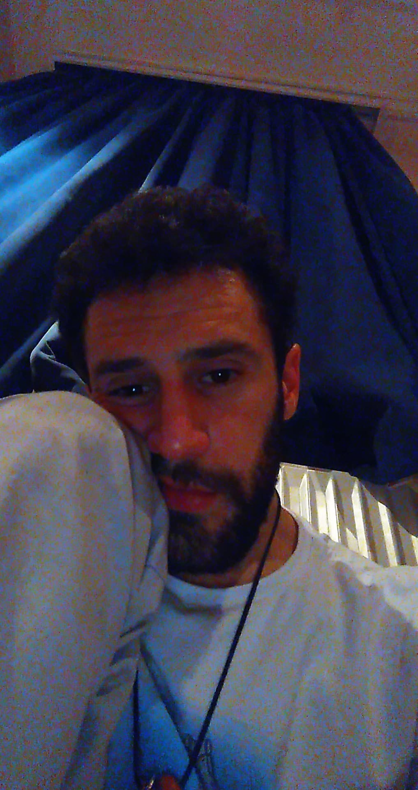
```

Yes, this is the face that people don’t see. The one I have when I feel miserable and lonely. The one that not even the person I am sharing my miseries with can see because when I am communicating my pains, I am already with another being, so my suffering is lower. When I am alone, it is when I suffer. That is the face of my suffering.

Yes, I am writing a book not to A., but about A.. She has been a really important person of my life, the one that has connected me with parts of my nature and being that I was neglecting, that has shown me parts of human existence that I was completely ignorant of, that has altered my scale of values, and the one that has made me live an experience enlightening enough to motivate me to actually write and publish a book about it. A. is the next level of poetry in my life, my destructor, and my constructor. The need for destroying my past to construct a brighter future.

I won’t dedicate a book to you (yet), but, as you know, I am up to co-author one whenever you feel ready. It would have been good to talk with you on Saturday, but life… Life and civilization. Luckily, I found online the Dutch girl, N., that motivated me enough to go dancing.

About finishing my Ph.D., I think I have been clear about it. I feel it is slowing me down intellectually and professionally, apart from isolating me socially. The only thing was money, and money has changed its value since I don’t need it so pressingly anymore. I wouldn’t have minded a couple of months more, but two years and a half, it’s way too much. And that is a lot, especially for someone that wants to work as a dancer and its already 27. I don’t give a fuck about people respecting me or thinking that I am smarter or more worthy of their attention just for being a Ph.D. and have published some academic papers. I am free of that already, B. I will earn my respect and value in other ways.

About being chained in your head, you can be as chained as you have time and opportunities of spending time alone. If being in your head is painful and complicated, then, you can write or talk to put part of your head outside of your head. However, if you don’t write because of procrastination or lack of time because you have to work, and you don’t talk because you don’t have access to a person with whom you may feel understood, then, you are indeed pretty fucked, stuck in your head. (a.k.a. write me a letter).

The system may follow me, but the key aspect is that I can become as independent from it as possible, more skillful in how I want to use/parasite/benefit from it; and that is tamed and under control. I have decided to stop being used by the system, to start using it. To my pleasures and whims. That is the freedom I am talking about. I am aware of the value of money and some of the commodities of the system. I am also aware of the opportunities. That is why, if I can have a business online, I can use the money to pay for those aspects that I am still dependent on the system, like advanced western medicine, high-technological devices and tools like smartphones and airplanes, or water treatment tablets. However, let’s see how far and independent a community of 150 people with access to the internet, few computers, and a 3D printer can get.

About your ADHD, the same story. The sooner you read/learn about it, the better you will start functioning. You are treating yourself with nature, so keep it going. Your present and future relationships can also get improved by you learning about the neurotype.

About nuclear energy, I don’t agree. I think it is more important to reshape human needs and adjust them to renewable, decentralized sources of energy. Living in self-sufficient communities fed by solar power, for example. For bigger projects and needs (hospitals, factories, airplanes), that is out of my professional domain, but maybe a bio combustible (if renewables are not enough) could be okay. Also, nuclear fusion seems quite promising, although it wouldn’t make us change our devastating habits, which I think is a more important issue at this point of planetary resources. So, you ask me today, and I answer in this primitivistic, regressive sense. Fewer needs and sustainable energies.

Just so you know I am not kidding or daydreaming with all that, we (the sisters in Zambia and me) are already checking lands, locations, and prices. This is coming, B. It is coming soon. So, even if you split with M., make yourself a favor and don’t suicide. Your life will become much better just by taking some decisions and making some changes.

Thanks for the compliment about my singlehood. I managed to stay singles because of the overall fear of people in our society, especially women. I know few women that see a good looking, healthy and fit guy in a public space and dare to start talking with him. I also know few women that don’t feel scared if the guy is too straight-forward, weird and it is difficult to understand what he is talking about. I knew few women that dare to transform their ignorance into curiosity when meeting someone new that seems to be knowledgeable about different topics. Much in accord with what a friend of a friend told me once: “I am looking for a woman that has no fears.” In my case, I found one. Her name? A.. After the experience, I am warier if the woman I am meeting has no fears. However, indeed, I am looking for a brave woman. As it is reflected in my answer to C. above, she said that I am “an alien” in this society. In that same conversation, they (C. and M.) mentioned that they had met a girl in Zambia that was like me but in a female version. That was another indicator that my loneliness, as well as my lack of a romantic partner, is probably not originated by lacks and faults in my character, but by the inhabitants of this sickening environment. I don’t have anything against them but understand me when I am having trouble finding people I can connect with here.

Indeed, with a girl, or a small group of friends, I wouldn’t have been so miserable, and I would have been able to finish my Ph.D., saving more money, and who knows if even having developed a more “standard” life. But using some woo-woo talking, the wisdom of the universe wanted me to experience what I have the experience to keep this lesson for my life and spread it unto others.

I told you that I am a tiring asshole, and still, I think I am. That is why, I feel I need a whole community because if I only have one romantic partner and two or three friends, I can easily drain them all in one bad evening. My family was witness and sufferer of that during my last Christmas when I arrived ready to challenge all their beliefs and undo our subtle catholic indoctrination. My father couldn't admit that I had ADHD but couldn't deny that I had been arguing for more than 20 hours in two days, and I was ready to keep it going.

Indeed, many of the people here dream of and aim of feeding the system. My goals are escaping from it and change it. So, you can see the differences in priorities. I may have been unlucky or not perseverant enough, and indeed there are wonderful people here with whom I could have been connected, but it is too late for bothering myself with that. I don’t care anymore; I have taken my decision and that is all it matters to me now.

You mention:

> *But through feeding the system, they/we feed ourselves. But it is like a really harsh taxing system - you get something, but you have to pay a lot for it. I think dating you and having a good time would consume less energy than breastfeeding this sick system.*

Check the book, the second title is “The price of progress”. So, you get the idea. Whether dating/living/working with me is more or less consuming than living in this system is something people have to experience themselves. I welcome them if they want to try. The case you mentioned of the couple with the kid and the mortgage for 35 years is not news. God bless them, victims of the system.

> *But not enough time for connections in general. I see it all around me, I do it also.*

My friend J., which we both love each other and like to spend time together is currently in Amsterdam, a 3 hours bus-trip away from me. I offer him a visit, but he told me he is busy, he has to work, and that there won’t be enough time. Thus, the system sacrificing a social relationship. A very weak example after reading this morning about single mothers in the US that have two jobs to cope with their toddler expenses.

> *But if I want to keep myself away from insanity, I need to stay away from TOO MUCH contacts*

It depends on the quality of your contacts.

Look, you even wrote half a page with two Facebook messages. Image how many could you write if you focus  

> *For example, and I know that you don't like typing and Facebook but I will write it anyway, I know that I am doing a favor to the system by not having contact with anyone except for M and couple of close friends but man... I need to stay focused and I am already struggling with finding a new job, learning digital marketing, reading for the bookstore so I can write the blog, learning this, that... sometimes I don't have time to sit in front of the computer, play a videogame and drink beer. It is fucked up and I know it is me and my time and my planning, and maybe I shouldn't drink beer, yes, but hell... it feels good in the evening after the whole day of office sitting and listening to the online digital marketing course. But I am still running every day after work, I am back to this routine and it keeps me going. But to be honest, your ADHD diagnosis for me sometimes feels right, mostly when I see that I need so much more moving in my life (that's why I like hiking and running - maybe from my kinda chubbiness someone wouldn't tell, but running is good for me, it keeps my energy in check. Instead of being tired and napping after work, I jump around the apartment and sing and annoy M... sometimes I think M. cannot stand to see me happy wahahahahahahahah* 

Lovely how you describe the self-poisoning as the toll of civilization and loneliness. Your willingness to drink beer and playing video games will likely fade away if you had few friends to play with after “working” on something meaningful. Maybe it would be just a way of clearing out your brain of intellectual work, and balance it with some much-needed exercise. We live isolated and in a really badly designed environment. Your chubbiness can be your genetics, accumulated bad dietary habits, lack of exercise, or many other things. All of that could be easily reversed in the right environment and with the proper habits. Obviously, sustaining healthy habits is a much more enjoyable and easier task when surrounded by supportive people.  Looks like fasting is quite good for longevity and overall long-term health. But who is going to avoid indulging in some sugary food after a day of lonely work at the office? After all, we all need our sources of serotonin… If we could put more meaningful relationships in our lives, we could easily cut off poisoning sources of shallow and damaging pleasures in our lives. Just saying. I am confident I could gather the data with a bit of research. Not in the mood, right now, though.

I made a small list today waiting for the train, so I will use it. M., as well as most of us, civilized apes, is very likely to be deprived of love/sex/sleep/nourishing foods/fun/free time/nature/fresh air/clean water/meaningful social connections/creative opportunities/social support/loving education. On the other hand, she (as well as us) is likely to have too much food/clothes/commodities/responsibilities/sources of stress/cleanliness/pathogens/material things/information on her life. Compassion to her and all of us that have to bear all these lacks and loads in our current lives. Referring to what I mentioned in our conversation. I used to rationalize my disdain and disgust towards people that had a community. I used to say that they were pack animals, lacking identity, self-reflection, and individuality to recognize their own selves. I always found them too sheep. However, now, I am realizing that these feelings of unease and annoyance were probably a defense mechanism of my psyche originated from my own social lacks. That feelings of belonging to a community that I never had. Something similar happens when I see forever happy couples on Facebook pictures. Thus, I can understand how hurtful can it be for someone that hasn't had a proper social life, either in the familiar, romantic couple, or community level, to see other thrives. It is that subconscious negative feeling, that destructive jealousy that doesn't seek to have what the other have, but to destroy what one lacks. I guess A. could relate to this.

About many of the other problems that are present in current societies, lack of a community and exclusive monogamic relationships of emotional dependence are two of the main reasons. Mothers and mothers-in-law would be happy about each other in a community of uncertain paternity. First, you don’t know who your mother in law is actually. Second, all potential grandmothers are mothers-in-law, so you would have to either be in bad terms with a fourth of the community or be loved by all of them. Also, when two people have had enough of each other, they usually need some time and some distance from each other to reflect on the situation with perspective. That perspective is given by a third person that you can share your mind with, that can advise you and recommend you what is best for both. Thus, isolating oneself with one romantic partner seems to me a doomed recipe.

As I mentioned, the moment now is to connect those alone individuals that are fed up with fighting with their sickening immediate environments, that have realized that this civilization is unsustainable and that are willing to withdraw from the luxuries of materialism in order to connect deeper with their nature as Sapiens. Those people that, once living at peace in their community, would feel the necessity of spreading the message to all those that are still trapped by the system, in order to explain to them how to get out of it and build their own community. I don’t think it is that difficult. And if it is, I will figure it out soon. Thus, find me some “enlightened” that are willing to collaborate on saving themselves and then spread the message to the rest of humankind.

I don’t think I am turning “normal”. I hope I am just becoming more “human”, more in line with my real and true nature as homo sapiens.  I am glad you become a more “human” loving being after you can connect and express yourself with me. It is a pretty “normal” consequence, though.

Finally, here it is the already spoiled closing. I don’t love and hate you. I love you. And I would love to witness how you tackle your full potential. Although, much like me, I guess that you need many people around to reach that stage of existence and levels of performance. I will be waiting.  

Best of loves,

Carlos

PS. Start fucking writing.

## 2020-02-28 To C.

2020-02-27

17.29

Entering Eindhoven, on the road towards Munster.

Hello C.,

### Before the bus

I spend the last day at T. T.’shouse in Antwerp.

Today, we ordered his room, went to the city hall to do some paperwork for his driving license, shop vegan food and cook something quick before I left. It is amazing how materially exaggerated is this country and this part of the world. So much that it becomes inefficient.

That is what happens at T.’s house.  That is what happened at his room. And, fortunately, the material abundance of our groceries will let their parents have something for dinner when they arrive from work. Tom is a great growing young human soul. I met himwhen he was 12, and I was 22. Now he is 18, I am 27. We are both getting older,like everything else in this part of the universe. 

Today, he received his first lesson on life organization, how to keep your stuff and living place in order (basically, by going minimalistic), and how to feed yourself and cook, basically, by going fruitarian when you are by your own, and having some basic skills with the pan when you are eating with someone. No big deal. 

```{r corona, fig.cap= "Multilayered picture after ordering the room.", fig.margin = TRUE, out.width = "75%", fig.align='center', echo=FALSE}
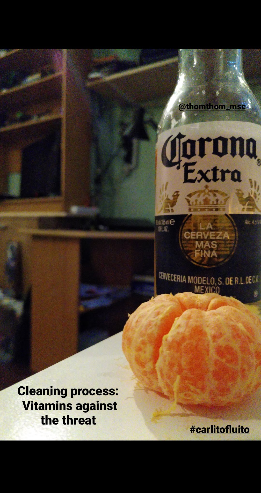
```

### Yesterday night

Let's keep the backward storytelling. Yesterday night, we chill and talk over a cup of tea. Lives, loves, dreams, plans, and interruptions from the smartphone. The dog stopped barking at me and start licking my feet. Maybe to erase the last drops of Mortimer’s saliva. We were tired from the training, so we went to bed a bit later. 

Funny parentheses. In the middle of the night, while I was dreaming, at some point, I woke up and notice a presence in the bed. I moved fast, grab the being and asked:

--- *Who are you? What are you doing here?* 

That being was T. T., whom I had just woke up with my instinctive reaction. After realizing that I was at his bed, I said: 

--- *You are T. T.. Okay.* 

I laughed a bit. 

--- *Fuck man… That was weird. I am going to pee. I will tell you tomorrow.*

So you see. This is my level of surviving system. I can sleep on the bed with a friend and wake up in the middle of the night fully disoriented and ready to fight whoever had invaded my sleeping space. Even when I am the invader. 

We were tired because we have gone training after being on the shopping mall with P., Tom’s aunt. The training was okay. I saw some old friends, dance a bit, oil my rusty body, and communicate with some lovely souls through the phone. Many things are coming, really, really fast.

### At the shopping mall

Eating with P. in the shopping mall was a peaceful experience at the system. P., like Tom’s parents, works too many hours for ungrateful people. It doesn't matter the occupation. I have that sensation that the average individual of this system works too much, complains about it, and then spend the time and the money they earn in ephemeral entertainment and material things that take over living space at their homes. I feel very sorry for them. Many people of our generation, like you and me, have the opportunity of breaking this wheel of reincarnation and avoid becoming our parents. We should honor their sacrifice and devote fully into building the best lives possible for ourselves and those around us. At this moment of life, spending my life doing a job that I don’t like and that is not meaningful for me, it would feel like a huge disrespect to all the effort my parents put into me having the opportunity to reach this point of existence. Also, it would disrespect and disappoint humankind as a whole to waste my potential in exchange of some monthly salary. I have interiorized it so solidly, that it has become part of my nature, of my thoughts, of my beings, of my reality. 

We ate at a wok place, and then an ice-cream. I was receiving quite a few messages from different people showing me their love and support and good wishes in my journey. I love to receive love, and I love to give love. Getting deeper in the understanding of give and receive.

```{r food, fig.cap= "My lovey extended family.", fig.margin = TRUE, out.width = "75%", fig.align='center', echo=FALSE}
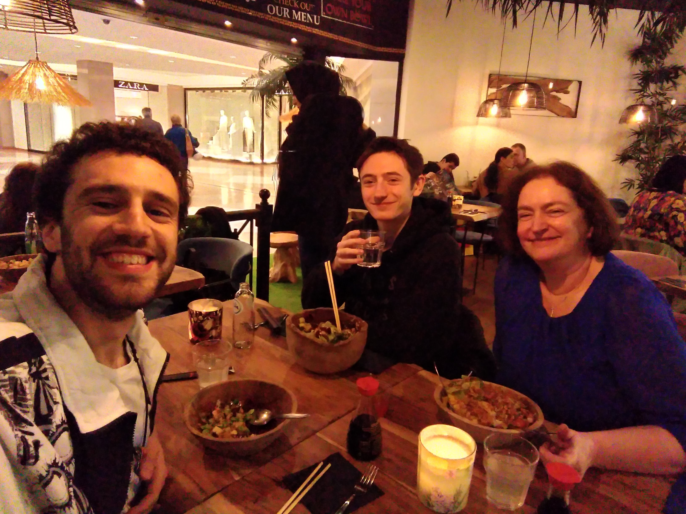
```

### Tea at Tom’s place – Future plans

I had drunk a tea with Tom’s mother at his place before going to the mall. Talking about future plans. Plans that can be divided in short, medium, and longer time. However, I would stay at short and medium because everything is happening way before I expected, and who knows how far and how big we can get. My next months are just a classical trip around Europe. Munster, Holland, Amsterdam, Berlin, Copenhagen. Connecting with lovely people. I don’t care about cities anymore. That period was overcame in [Agra, India](https://www.carlitofluitoideas.com/tag/india/). There I realized that people were more worthy than buildings. No matter how beautiful the building is. After Copenhagen, I will stay in Spain. I have to go to the hospital to fix some Indian sequels, and then I plan to visit the south of Spain. It is embarrassing to admit that I haven’t visit the Cordoba’s Mosque, Granada’s Alcazar, or the center of Cadiz. I have lived in Jaen, though. (Although, I think that that year at University of Jaen, makes my lack of Andalusian tourism even more unjustifiable). Anyway, we’ll see. That is still open.

Something that is closed is the trip to Ukraine at the beginning of April, and then the dance battle at Barcelona. After that, I was thinking about going to Latvia, to a Youth Exchange called *Cuddlenation*. The objective of the exchange is to delve into physical contact with others. I thought, (and still thinks), that it is a great opportunity of getting spiritually cleaned from the damage that the lack of physical contact of A. caused me. However, they didn’t facilitated much my presence there, and it has already happened that organizers of Erasmus Exchanges get threatened by me when I pop up there with my *tsunami-like personality*, my social, creative, and organization skills, and my proactive attitude. I may be too much for them. I am also starting to understand and interiorize this. I don’t care if it sounds boastful or prepotent. I care very little about it already. I am realizing that I am ready to communicate with crowds standing on the top of a stage, and in this case, the conversations would be productive and effective for both. However, many times I find myself trapped having to explain and defend my approaches and behavior with people that don’t believe in what or how I do things. Thus, I may or may not go. Probably not by the way, due to something that happened on the studio during my last night in Brussels. Sort of my own private *Cuddlenation*^[Keep reading.]. 

Also, I have the feeling that so many Instagram accounts and “influencers” are shallow, simplistic, and basic, that I have to control myself to not feel annoyed by them. I am already over them. That level was overcame years ago. I observe their path, and I am happy they are taking it, they are doing it. But, the content they create is not for me. I find it too repetitive, nothing new, no dopamine hits. Just time lost. 

Thus, after Barcelona’s dance battle in mid-April, my life is open. I was thinking about going to Formentera for a bit to write and closing as many [Unfinished Books](https://www.carlitofluitoideas.com/unfinished-books/) as possible. Also, in the summer, we’ll see how many of the applications I have sent turned out accepted. The most important one is the Watermill center in New York City. An artistic residence of about a month with big players within the artistic world. Participating there would be a [huge opportunity](https://vimeo.com/387988718) to materialize the upcoming projects in Zambia really fast. Faster than expected. We’ll see.

At the latest, I will be landing Lusaka at the end of August. I have agreed to perform in the [Zambian Dance Festival](https://www.facebook.com/zambiadancefestival/) my friends are organizing, and giving some workshops there. That would be fantastic since people would see me and getting more dancing works afterwards will be easier. On the other hand, it is a bit of a pity to sacrifice participating as a “priest” in a bonding ceremony that is planned for the same dates. Anyway, I will help with the ceremonial organization of the wedding.

In Zambia, I have some things to do. As I told you and P. in the voice note, when I was asked at the Yoga Studio ^[More info further down this letter.] what were my plans for Zambia, I asked: writing, dancing, explore my consciousness and explore other’s consciousness. That is it. Simple. Four things, instead of three because of the ADHD, you know. I am going to Zambia to build, to create. The main things to be done are: 

1.	*A community to live in.* As you can guess, ecological, zero waste, sustainable, off-grid, as independent as possible from the system/civilization, and with lovely and spiritually advanced souls. Not more than 150 people to keep things in order and organize without the need of developing complicate laws. Ruled by love, trust, generosity, human contact, humor, and mutual cooperation. Digital horticulturalists with the same values and common interests. That would be easy. ^[For more information, check the [previous letter to B.](https://carlitofluito.github.io/letters2019_20/depths-again-february-2020-2020-02.html#Borna)] 

2.	*The temple: a spiritually oriented resort*. A place to explore consciousness. Somewhere safe where people can come to try diverse practices and approaches to experience different mind functioning and levels of awareness. Different plans considering the background of the people. A basic plan of a week, a luxury premium gold diamond plan to finance comfortably the rest of our projects, and a pilgrim experience with basic commodities and some maintenance work included. There, everyone can chose their desired activities: psychedelic explorations, medicinal plants, aromatherapy, art therapy, gong baths, floating baths, spiritual exercise (yoga, taichi), silent meditations, reiki and healing sessions… Whatever pops up in your mind when hearing the words “spiritual practices” will be available at our temple. It may take more or less time, but it will come. It will grow. 

3.	*The consciousness research center.* This is the place where analytics pseudo/super-scientific knowledge will be found. Here, a group of researchers will use the quantitative and qualitative data collected in the community and the temple and, with the help of artificial intelligence, they will untangle the intricacies of the deeper levels of the mind that we understand as spirituality. We’ll need software engineers, programmers, data scientist, psychologists, doctors, physiologists, sociologists, and whatever the -ist you can imagine. We’ll put the academic world upside down. 

Meanwhile, I will be publishing scientific divulgation books as Non-Ph.D., and performing as [Carlito Fluito](https://www.carlitofluito.com/). I don’t aim to become the guru or shaman of our community since I already know many people way more advanced than me on these matters. On the other hand, I guess I will have a quite leading role in the community, the research center, and some level of organizational management at the temple. 

So, that is the idea. Visualize with me, and the visions will become truth faster.

Coming back to our story. I met T. T. at the Antwerp Train Station.

```{r tom, fig.cap= "Tom and me doing the classical 2005 Break-dance pictures.", fig.margin = TRUE, out.width = "75%", fig.align='center', echo=FALSE}
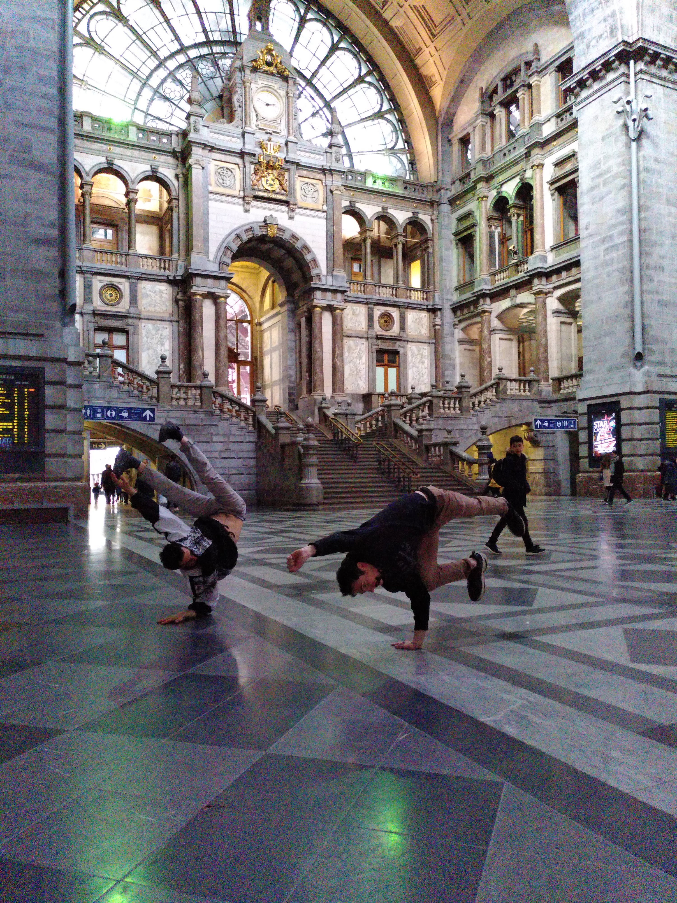
```


If you have Instagram, [follow me](https://www.instagram.com/carlitofluito/?hl=en) to be updated with my journey. I usually post some stories about the different steps. Several layers of meaning and information in each story. It is not my goal to create irrelevance for the shake of irrelevance. I already did that in my *24-hours social media experiment*^Under construction. May I receive your understanding or collaboration messages. 
]. I try to cheer up life with some stupidity and from time to time share some useful information.

```{r antwerp, fig.cap= "Beautiful station but...", fig.margin = TRUE, out.width = "75%", fig.align='center', echo=FALSE}
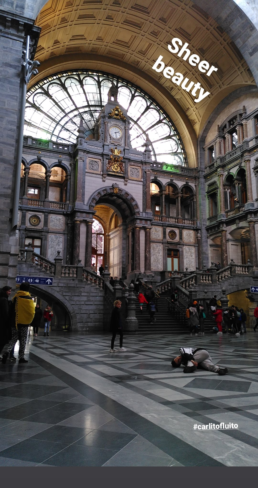
```

Anyways, the core of my valuable information is shared through [my texts](https://www.carlitofluitoideas.com/unfinished-books/) and [YouTube videos](https://www.youtube.com/channel/UC5Q8igPq_lE1JQNwbjjy7wA). Go ahead, subscribe, and support.

### Last morning in Brussels with K.

I slept on the bus from Brussels to Antwerp. Too tired to write. Procrastinating, or merely taking care of myself. I stopped self-punishments anymore, I am just writing for myself. No bosses, no duties.

```{r chaman, fig.cap= "Wise as f*ck", fig.margin = TRUE, out.width = "75%", fig.align='center', echo=FALSE}
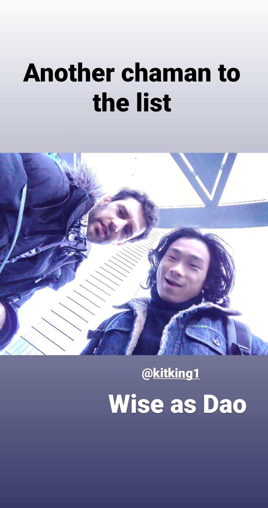
```

K. came with me to say goodbye at the bus. Like many others, he was really happy for me leaving Brussels, but hurt and sad at the same time for physically distancing us from each other. He is wise as the Dao. He heals by receiving massages, and he is one of the kindest and purest beings I have met in my two years and a half in Belgium. He came the previous week to help me packing, came back on my last night to help to order, and stayed during the morning for the last details at R.’s place. He is wonderful. He deserved heaven. He has a place reserved in the community until he departs and builds his own.

```{r twin, fig.cap= "This dog has made me think that he was a reincarnation of myself living simultaneously. Basically, my being on his body, silently looking at my development.", fig.margin = TRUE, out.width = "75%", fig.align='center', echo=FALSE}
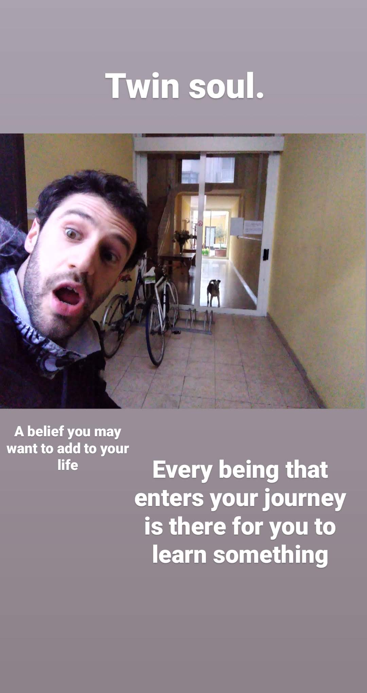
```

K. and I ordered R.’s house until the last minute, clean up the patio, and close the doors of the place together. I don’t give a fuck what R. complained about the state in which I left the studio. Fully ridiculous. None of my problems. He is over as well. I am assumed my higher level of maturity. My soul is older than his. I cannot get distracted by his childish attitude.

```{r stage, fig.cap= "Lots of performances there...", fig.margin = TRUE, out.width = "75%", fig.align='center', echo=FALSE}
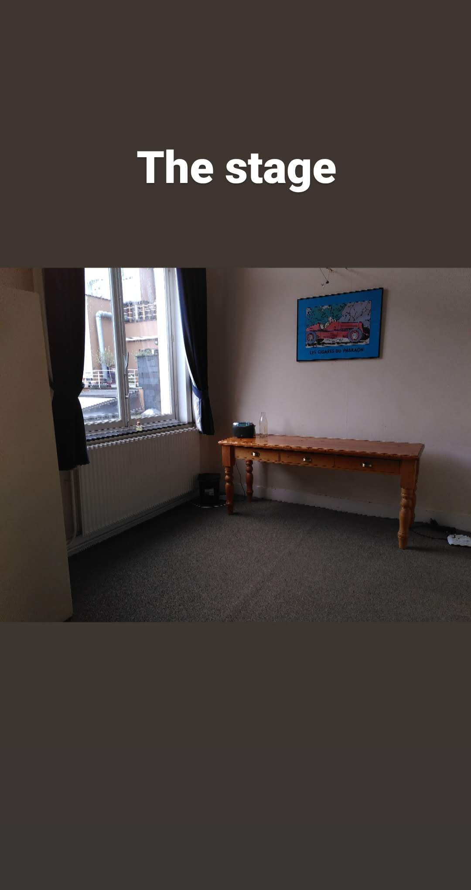
```

### Rituals before starting to dream

K., S., and C. slept at my place. They did so because they stayed after dinner and helped me clean. The cleaning was fun: stupid jokes, mansplaining and womansplaining, poo2theloo, the correct degree of physical exert after dinner, and physical tiredness when the task is completed. One of the wonderful things that happened that night was an idea I had had less than a week ago. In my personal ritual at the bath, after raising my vibration with a couple of puffs of marijuana, and filming “*Tutorial: How to have a spiritual experience?*”^[Under construction. May I receive your understanding or collaboration messages.], I had the insight of being in Zambia with my friends, and giving massages to each other in a ritualistic way, at least, once per week. We are all dancers that work with our bodies, and we easily accumulate tension and damage, not only from the physical effort but for the cohabiting dynamics. Sharing a place to live, projects, and occupations can create frictions and eroding positive dynamics between each other. Thus, it is fundamental to have a cleaning ritual with a fixed frequency to get rid of the bad shit and welcome the good shit. One of the most simple, humane, and direct ways of doing so, is to give massages to each other. Normally, a massage of 45 min can cost up to 50 or 60€. However, what is the point of wasting the money you earn in a massage if you have people that can massage you in exchange of massaging them back? That is the point of living in a community. Using the money for obataining the things you really need money to acquire. Not massages, dog sitters, nurses, teachers, psychologists, sociologists, and so on. Please… Come' on.

Thus, after cleaning, I introduced the ritual by saying that, by turns, one person will massage another while telling good things about her and their relationships. K. proposed that the three of us will massage the fourth at the same time (which was an idea I was reserving for later). Thus, we did so. In the beginning, we limited the massage to the hands, to avoid sexual connotations and discomfort, but then, people understood the dynamic, and respectfully we spread the surface to be massaged. The material abundance, *Lush* free samples, and my dermatitis allowed us to use a wide range of creams and balsams. I was burning a piece of sandalwood in absence of incense stick. Some candles allowed the melatonin to spread comfortably all over our brains, while the oxytocin was flooding our whole system due to the human touch. S. was the first. She was the tryout, mostly a massage on the hands, and lightly on the head, neck, and back. I remind her of the idea I had had a few weeks ago about the *alarmasseur*, which is the rotating role in the community that is supposed to awake others by giving them a massage. That night was more like, *sleepmasseur*. I told her some good things about us that she already knew, but is good to hear and say anyways. Love was flowing.

Then it was C.’s turn. C. is going to leave the system soon. She also got fed up. We understand each other perfectly. She wants to learn about nature, about plants, about the earth, about permaculture. I told her how wonderful and beautiful her future is going to be; how much she is going to know about non-animal life, and how she is going to support the growth of these supposedly passive beings. Also, I told her that she will come to our community to teach us about plants, but she will do it in a way that adults and kids can participate in the same workshops with stories about vegetables that contain hidden information about how often different plants should be watered, what is their favorite soil, and how you know that the fruit is in the best state to be eaten. Look, I am a hedonist. But I don’t want to waste my hedonism seated watching TV and eating chips. You already know this. I want my hedonism to gravitate around living with wonderful people that love me to the utmost, giving me 12 hands massages, while putting the fresh, bio, ecological fruits that were just picked up from our garden in my mouth. I won’t satisfy with less. And I pity those that do. Until that happens, I will keep drinking water and sacrificing those petty pleasures that people take daily thinking that they are being *Bon vivants*. I don’t want to be a *Bon vivant*, I want to be a *Bon mourant*. I want to die at peace, surrounded by love and pleasures, and I just get there step by step, sacrificing small and superficial pseudo-hedonistic moments to get closer to more meaningful ones. Like the one in the room the other day. Merely with the example of comparing the taste of a supermarket tomato with a fucking real tomato, it is enough to enlighten most people about what I mean. Good luck to you all that chose civilization.

After C., it came K.. K. is a dancer, so his massage was more guided, especially in his damaged right ankle. He remembered the story of the day when he got run over by a car before our meeting, and how I ended up in the hospital contacting the people of his dance company. You can imagine the number of wonderful things I said about him. The size and vibration of his soul is something to be experienced. Thanks to him there was an actual dinner, instead of a cleaning gathering. (Keep on reading.) At some point, K. said something that if it catches me high on weed, I would have freaked out to the next level.

--- *Some people repeat their lives in cycles until they find the key, the experience, that allows them to move to the next stage.*

Fuck, he was describing me. I was there, in Brussels. Saying goodbye to my life, welcoming a new stage. Taking a huge jump forwards, renouncing to a big dream of my past, to a state of comfort and commodity, risking a lot. And still, it all felt wonderfully correct, peacefully right. I was doing what I was supposed to do. I was enacting it and embodying it. It was possible, it was happening. It was my last night in Brussels, I was with three other lovely souls giving and receiving love after a wonderful dinner, and a session of cleaning. It was that moment and that sentence. It was happening. I had found the key to move to the next stage of my life. Fuck, it was happening.

After I freaked out for a bit and told K. how wise he was, and how he was able to heal people while receiving massages (*You will see when he is giving you one  …*, S. said), it was my turn.

I was really looking for my moment, and I had a few things very clear by then. I wanted to lay down. My body was damaged on the neck (which had cracked a couple of times while I was massaging others), my right wrist and ankle, both trapezius, and of course, feet, face, and hair for the sake of pure pleasure. Also, my hips are kind of locked, but that is something I have to work on through hours of yoga. I played some Ohms and warned my masseurs that I won’t be able to tell them to stop. So, I made them free to stop whenever they wanted before they started. I peed, wash my face, my nose and my mouth (*Next time we’ll shower before starting*, I thought), took off my shirt and laid on the floor. S. took my face, K. went to my ankle, and C. focused on my hands. As K. had mentioned, and S. and C. had agreed, it was a great feeling to experience how the three masseurs are connected through one’s body. I felt it then. I try to relax, focus on the Ohms, focus on the touch, focus on the feelings, just sink down. I enjoyed the experience. However, my relationship with my body asks me for high intensity. When I am able to jump, flip in the air, and land perfectly, I celebrate it for a few times before I move to the next acrobatic movement that I am not able to perform. When I am lying down with ohms, good smells, filled stomach, my house is clean, I have three lovely friends massaging my body, and nothing else to do in my life than relax and enjoy; I try to fully surrender to the experience, but sooner or later my brain will come back to think about things that are not working perfectly, details that can be improved, and future plans that will be even better than the current moment. I prefer to blame my ADHD brain than myself and fully acknowledge that this is what my current existing life is about.

Few days ago, I had the intuition that I will reincarnate in a tree for the next live. You know, just acknowledging that I cannot move, talk, or do much, other than letting myself be moved by the wind… I guess that the universe is balancing consciousness and teaching them how to perform any state of existence possible. Anyway, this is the life where I have to be talking. So I talk; so I write.


K. tried to fix my hips, C. relaxed my calves, and S. moved to the neck. A bit later, C. and K. started to massage each other, and I hugged and thank S. for the massage and her presence. I asked her to cover me with my merchandising t-shirt: [“Truth is non-violent”](), and then, asked her to try to unlock a muscle contraction on the back, and the beginning of tendinitis in the right shoulder. 

```{r nonviolent, fig.cap= "This is my merchandising t-shirt. I have give for free most of them. If you want to pay for one, contact me.", fig.margin = TRUE, out.width = "75%", fig.align='center', echo=FALSE}
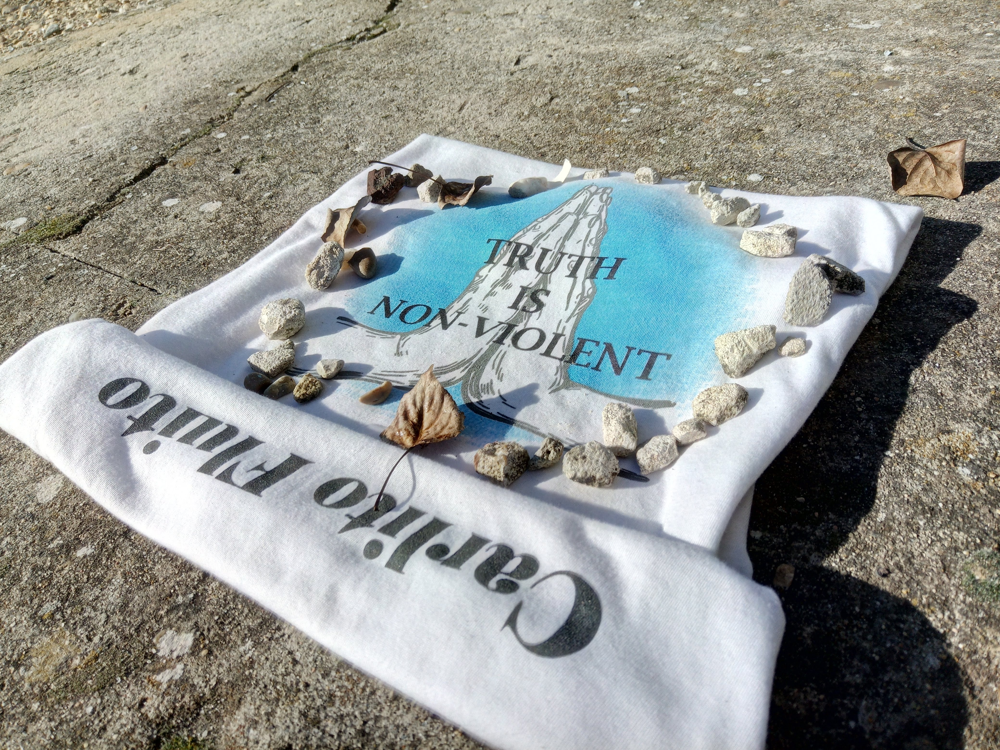
```

After a while, S. was tired, so I offered her to go to bed and I would massage her until she would fall asleep.

--- *That's the best idea you've had since I know you. Better even than going to Zambia*

I took the clothes of my trip out of my backpack and offer them to my guests as pajamas. I left some beddings available if K. and C. wanted to sleep on the carpet, and also offered them the possibility to go up the bed. The mattress was big, and we could all have fitted.

I went up and massaged S. for a bit, while I was talking about the research center and how the people in our university would have to quote our studies, and how our impact would be much higher than whatever the studies they were doing at the <span style="font-variant:small-caps;">UCLouvain</span>. We also talked about monogamy, and how ridiculous all those people that limit their physical, erotic, and emotional love to only one person would look like. We joked about the average size of a Zambian penis, and how we, white European guys would have to cool down our egos. We dream together in the bed before going to sleep. We fall asleep hugging each other, giving and receiving love, holding our hands, in my favorite sleeping position, with her head in my chest... 

Before sleeping, I tried a brief spiritual exercise. I have been practicing different techniques these days, and specifically, I am doing the [Unlocking Transcendence Course by Jeffrey Allen](https://www.youtube.com/watch?v=NJ948ODaRvg) at the [Mindvalley platform](https://www.mindvalley.com/). At this moment of the course, the exercise is about visualizations and contact mentally other people. I do it for explorative purpose, trying to remain openminded, and not scaring the shit out of myself when something difficult to believe fucking blows my mind up. Thus, there in bed, I tried to contact Jeffrey Allen, himself. I saw myself surrounded by a grey bunch of viscose things. They felt like lives, consciousness, people. I was moving around a realm and dimension where the souls reside. I was serpentining this space, moving around this consciousness, and little by little there was more space to move. It was easier to move, and I was getting closer to my objective. But I arrived at someone else. I didn’t find Jeffrey Allen, it was another person. It was [Christopher Ryan] (https://chrisryanphd.com/), the writer of *Civilized to Death* ^[\@ryan2019civilized], the book I haven’t fully finished yet. It was difficult to maintain my attention without losing the whole trip, and once there, I tried to communicate with him and express my gratitude and love. I am not sure whether I fall asleep after that, or I recovery normal consciousness on the bed, next to S.. I had the words of my friend C. on my mind concerning how important it is to feel like a protector when you are sleeping with a girl on the bed, and how I didn't do it when I had the opportunity of sleeping with Sh., back on my days in Salamanca ^[For more on my love stories check [Unfinished loves](https://carlitofluito.github.io/unfinished_loves/)]. Therefore, I remained lying down on the bed, half awake, half slept.

There, I dreamed something very easy to interpret. I was surrounded by people. My group, my tribe, my community. Then, S. and I were kissing, and somehow her tongue reached my throat and I waked up choking on the bed. However, I was able to come back to the same dream easily ^[Playing with visualizations and altered consciousness states allows to swift between dreaming and awake quite smoothly preserving a fair deal of the events of the dream in the awakened memory.]. In the dream, I expressed S. my physical limitations, and how she had reached a point where I had to express my individuality and respect myself. However, one of the characters on the dream told me that I was a coward, that I had to go further, that I didn't dear to go beyond. Then, I realized that that character was a psychopath. My experience with A. has equipped me with a whole set of skills and a new awareness to detect and fight emotional and psychological abuse. There in my dream, I detected her almost instantaneously when, after expressing my limits, that person pushed me to go over them right away, even when they were risking my life, since I had almost chocked. At that point, I confronted the psychopath with her behavior and attitude, and I told her to leave us all, explaining the rest of the group why she was a psychopath and what she was doing. After her trying to confront and menace me, the group agreed with me and she was forced to leave ^[Just a naïve footnote... What percentage of your thoughts are generated by you?
I was meditating 10 minutes to take a break form the screen and reaching the end, a voice entered my head. *Who am I Carlos? Who am I?* I have chosen the path of remaining human. I chose it twice. At the [Vipassana](https://www.youtube.com/watch?v=l17lZ2T-zWE), and on my terrace on Leuven, when that distant point of light kept on approaching to me until it become a floating multicolor sphere in front of me. Today, whatever it happened, happened, and it is getting closer and closer. It is coming, my people, it is coming. It is coming fast. It is happening now.]. After a while, the same character entered the room again, this time in the form of a big male figure. Still a female inside, though. Then, I stood up holding a small girl on my arms. Looked like I was the leader of the group, I was the protector. S. wass my lover at that point, and that girl wass probably my daughter. The rest were members of my tribe. We were all together, we were a unity. I felt so confident about myself and my group, holding that girl, feeling the warmth of her body, her cute little arms around my neck and shoulders. I could just face that devil. Face to face towards the psychopath, I told him/her:

--- *Come' on, hit me. Show them all who you really are. Show them that you don't care to hit me. Because if you hit me you will be hitting her.*

I was referring to the kid I was holding in my arms. Humans are able to see clearly the evil when is directed towards vulnerable beings. As S. pointed out in the morning when we woked up and I shared my dream with her, I was basically using the girl as a human shield. However, I think that is a very mundane interpretation. I was betting high, true; but I was protecting myself, that daughter, and my whole tribe from the dangers of that psychopath. I was unmasking him/her, in front of everyone. I was playing harder than the psychopath itself. Psycho vs. psycho. Fire against fire. 

In the dream, the psychopath realized the trap. S/He felt how much s/he wanted to physically attack me and how hard was to contain him/herself from doing it, but it would have been too obvious if s/he would have done it. Also, the tribe was scare because if s/he did it, s/he would harm the kid. At some point, S. stood between the psycho and me. 

--- *If you hit him, you will also have to hit me.*

Other people start to standing. 

-- *And me.*

-- *And me...* 

The psycho realized that s/he had lost the battle. Then, we had the psychological and physical power to tear him to pieces. We started invading his/her physical space, making him/her retire, go backwards, while we grabbed his beard, and walked confidently and aggressively towards him/her. S/he eventually left the room again^[I am remembering a dream of few days ago, where A., my original psychopath enters my room and plays games with me. The people of my group (young ones, maybe children) invite her because I told them so. They convince her to enter the room even though she is unwilling to do it. Once inside, we are left alone and I told her that none of us can leave the room until we solve our situation. It feels a bit like a game in a *Jigsaw* film, a game I just created. We are both locked there, and our brains have to work together to resolve the puzzle of our minds, our lives, our souls. However, she is smarter. She is more powerful than me. She triangulates me with another guy, a Muslim guy (like O. at the exchange), and somehow, she is able to leave the room, which transforms into a bus, and the moment she is outside with the guy, about kissing him or something else, the bus starts moving away, and I am feeling like losing because she manipulated me again, she was able to break the rules and go out of the room, while I am forced to leave the place against my will in that bus, passively doing nothing and accepting my situation while she is with another guy.
How different the whole story was at the dream of the night with S. ...].

Then, we started celebrating our victory, and after a while of enjoying the loyalty of the group, R., the landlord of the house appeared with a set of hitting things. He had baseball bats, cricket hammers, golf sticks. It was like if he was showing his aggressive and material wealth at once. It seemed that the psychopath had gone looking for help and R. had came to the rescue with his whole set up of tools. It felt a bit as when two males show off in front of each other, displaying the potential of her bodies before entering into combat. I had my tribe. We had each other and ourselves, and R. had his tools. Since I was the leader of the group, I was attentively listening how the situation evolved. Some of my people were talking with him, explaining what had happened. However, I felt the fear of those that talked with R.. I still had the girl on my arms. I started to speak and I reasoned with R., that since he had only two hands, it would be fair that any one of us in the room would get something to occupy their hands with. Somehow, a black irregular mace materialized at my hands, and I told everyone that they can take a thing from R.’s display of instruments. Once we are all armed and ready, I saw how R. himself had also armed and protected, wearing a butcher apron, boots and gloves, and a huge knife in each of his hands. He had more sharpen tools than us, but we were more. My tribe was ready to fight. There would be casualties due to R.’s tools, but it would be an easy victory. Before the combat started, I pointed out that S. hadn't gotten any weapon. Before she chose I asked R., 

--- *What would it happen if now S. takes a smartphone, calls the policemen, and find all your tenants armed like this against you in these situations? Who would they protect?***

R. looked at himself dressed as a butcher with a couple of huge knives at his hands, with raging eyes thirsty of blood, and the crazy psychopathic look at his face switched to one of surprise and self-awareness when he realized the trap that he had fallen into. The dream was over.

I think it is quite easy to interpret. The power of the group, the symbolism of the loyalty of my lover, the fatherhood of holding the little girl, the leadership of the tribe, the resolution of problems, the detection of the psychopath, the material wealth accumulated on R., but unseful due to human limitations (only two hands), how once the wealth is distributed, even when the materially rich person is better armed, the socially loyal group is going to win the battle hands down, and the usage of civilization tools like the police in favor of small groups and against advantageous individuals within the system. 
To a more personal level, R. is R., and I am taking back my power and my freedom from him, and the psychopath is a representation of those people that try to manipulate me other than A., as it happened in the dinner. At this point of life, I am ready to enter into new battles, I am armed with psychological defenses that I can use as attacks. I am armed with a certain degree of material wealth that allows me to fight back the unfairness of this planet. I am building my tribe, my community, my team of loyal people that are willing of putting their life at risk for me. I am ready to love and be loved. I am close to being able to parent of a new human being. 

Dreams are full of information. The fact that scientific psychology has undervalued them, just point out how little the field knows about human consciousness. I don’t care about the generalizability of results or quantitavization of psychological phenomenon. I don’t care whether you can measure it or not. I am caring about what the fuck my consciousness is trying to process and communicate with me, what the fuck my consciousness is able to experience. If it is not scientifically replicable enough for you, believe me, I don’t give a fuck. Anyways, much of what "scientific psychology"" produces is not replicable either.

### Pot de depart

I had arranged to meet D. and C. on the center that evening, but I had still lots to clean at my place. I had also agreed to meet M. at my place. I was supposed to meet K. to give him the bike he had bought me, and S. wanted to see me once more to say goodbye. An., the flatmate had told me that she would come at some point to help me clean. I woke up from the siesta sort of disoriented. I couldn’t focus much, and I was moving around trying to figure out what was left to be cleaned, what things should I put on the backpack and what things I didn’t need.

While I was texting D. and C. to change the location of the meeting and told them to come to my place, my doorbell rung. M. had arrived at the same time as R., so I say hi from the door of my studio. M. came up, and I explained to her the situation. More or less. She started talking about her experience studying psychology at the university, and I very much understood how she was approaching and living it. Good professors, bad professors. Sometimes learning cool stuff, sometimes feeling like wasting time and life. She has to write me a letter, so I will wait until she does. I didn’t have much to offer, but I had some tea bags left. During our conversation, K. called and told me that he was coming and that he was buying some stuff for dinner. Perfect. I think M. called me as well to tell me that my advisor had expected me to go to the office that day. I had to wait for the transport guy to come for the package, so that wasn't in my plans.

A bit later C. arrived. I introduced M. to C., letting them know that there were no chairs at my place and that more people were coming as well. M. was seated on the fitness ball, and I turned the garbage bin upside down as an improvised chair for C.. It was good to catch up with C. and get to know that she was also following the path outside of civilization. Si. called me but it wasn't the moment to talk. S. sent me some voice notes that I half-heard. She was coming as well, a bit stressed and tight with the time. C. and M. were getting along, which gave me more time to organize my stuff around the room. I was also giving them extra pens, and lighters that I didn’t know what to do with. 

D. arrived. C. and D. knew each other already. I introduce them to M., and that gave me even more time to focus on my own stuff. A bit later, K. arrived. No one was expecting no one, and I hadn't planned anything either. Things were just happening as they were coming. There weren't enough tea bags for everyone, so people were sharing the bags and glasses. K. said that if I would have told him, he would have bought more food. I didn't care since I didn't have any food, and whatever he had was perfect, because we would all share it and eat something. We started cooking and the vibe got more friendly and lively. An. arrived dressing a big pullover and leggings, ready to clean, when she realized that there was a sort of party going on. Excepting C. and D., no one knew each other from before. When S. arrived, I told her that there was a Fiesssta going on and I asked her to guess how many people were in my room. 

--- *Eight*, she said.

--- *Come on, S.. I am the most fucking lonely guy in Brussels. I don’t have friends.*

She entered the room and saw M. and K., C. and D. had gone to An.’s to see her collage made of traveling pictures. They came back with some cake, and we set up the table. The dinner was ready, and S. had brought a bottle of wine. There were some interruptions with some smartphone calls. An. told me to ask Su., the other flatmate to join us. She couldn’t, skype call time. Everything was ready, and I asked for the attention of everyone. 

--- *Today is my night. I am the protagonist and my ego is skyrocketing.*

D. had bit already the food, although I told him to wait. 

--- *I control everything except my impulses*, he answered.

At some point, Mortimer entered the room and we took a lovely photo with all of us.

```{r supper, fig.cap= "Isn't Instagram destroying the quality of the selfies?.", fig.margin = TRUE, out.width = "75%", fig.align='center', echo=FALSE}
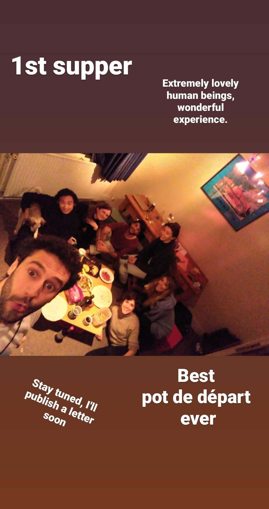
```

Before starting the dinner, I told them that I would read a tale I had written the previous day. It was in Spanish, so some people would understand some parts, and, some people would not understand anything. However, there was some sonority on the text, so everyone could enjoy it at some level. Also, since there were some complicate and very niche words, not everyone would understand everything. I would read the tale, we would cheer, and we would start the dinner. An. entered the room and I had to explain the rules again, being interrupted by her and her *Elevator speech advice*. 

--- *Patience and silence*, I told her. 

That was the opening ceremony and the blessing of the food. Here is the tale:

> 
> <center>**Mortimer**</center>
>
> *El árbol había dejado de intentar moverse hacía ya muchos años. Había interiorizado que no iba a crecer más. Había asumido su silencio.*
>
>*A sus pies nació un pequeño diente de león. Primero las hojas espinosas y planas. Luego, poco a poco, el tallo. Más tarde se empezó a formar el vilano aparasolado del que salieron infinidad de cipselas.* 
>
> *Vino el viento.* 
>
> *Embriaga de vanidad y dolor, la pequeña planta no admiró la belleza de las livianas cipselas que se elevaban y revoloteaban dibujando volutas y movimientos Brownianos, envolviéndose en el leve vaivén de las ramas del árbol. Tampoco escucho el secreto que el viento confesó al protagonista del cuento. *
>
>*Un tiempo más tarde, entraron los propietarios de la finca. Era finales de octubre. Talaron nuestro árbol y todos aquellos de su alrededor. *
>
>*El diente de león sobrevivió la masacre anegado por el último y tibio orín de un can moribundo que edulcoró las raíces del abeto, el cual experimentaba sus últimos instantes de consciencia. *

We started eating. A. told me to invite R. which was, indirectly, the person providing the house. I agreed to tell him, but he refused saying that he had already eaten. K. had bought some meat forgetting about my dietary preferences. S. re-interpreted my fruitarian attitude saying that I am not crudi-vegan, but *crudi-vagoncio*^[crudi-lazy]. She is probably right. Going frugivore is becoming minimalistic in the diet: less and fast shopping process; minimal cooking operations limited to peeling and blending; money saved; planet saved; better health, etc. At some point, I was feeling elated by the moment, and I admire how this people that didn’t know each other were sharing the floor because of the absence of chairs, eating from a few plates on a piece of wood lying on a box, sharing cutlery, food and wine I hadn’t bought, in a place that wasn’t mine, and that I was leaving the next day. It all felt lovely surrealistic. I said that it was the first time so many people came to that place. Later on, while cleaning I would say that it was the best goodbye party ever.^[To not offend my friends and organizers of the goodbye party in Leuven 2014. That one was lovely, very numerous, with a dancing event on the side, and many vegetarian burgers on the barbeque. It also had a lovely ending where V. and me shared that bonbon box that P. brought for me. However, that is a story to be told in another moment. (You may find it in the letters). However, the one in Brussels of two nights ago was next, next level.]

At some point, I joked:

--- *The strategy is to say to people that you are going to clean and then make the dinner. If you invite people for a dinner, everyone comes. But if you invite them to clean, then you know that only the best ones are going to come.* It was quite accurate though. 

Later on, I felt like sharing my impression of the dinner that was going on and comparing it with R.’s standard dinner.

--- *So, as all most of you know, my landlord is a guy that has money and likes luxury and all that, yes? So, he had dinner the previous weekend and…* Then, I got interrupted by A.. 

--- *Carlos, don’t talk about other people when they are not in front of you. That is not of good taste.*

--- *Well, I am not talking about him. I am just making the comment of comparing this dinner with one of his dinners, for example, the one that happened a few days ago...*

--- *Yes, but you need to learn how to adapt to all situations.* She interrupted me again.

I was losing my patience. 

--- *I am not saying that I cannot adapt to both situations. For example, I ate with him at Christmas two years ago, and I had fun. And I am not even talking negatively about R., I am just pointing out to the objective differences that are between these two situations that differ in the level of material wealth, and I would like to reflect on the social consequences of these two situations. For this, I would like to use this current dinner and last weekend R.’s dinner as an exemplary situation due to the irony that both of them are happening in such proximity in both time and space. But that is all.*

--- *Yeah, but you have to be comfortable in any condition where people are different and speaking about different things.*

--- *Well, that is interesting, because the fact that I am trying to talk about this and you don’t let me talk about what I want to express is pointing out that there is something in this situation that you are not adapting very well to. So, I could mirror you and be a bit psychopathic, pointing out at your behavior right now and telling you that you are uncomfortable here because I want to talk about this topic but seems you are not leting me doing it.* 

--- *Don’t mirror me, because I am reading the **Laws of Power**, and I am very aware of what you are doing and I don’t allow when people don’t let me say what I want.*

--- *So I am saying the same. I tell you and I ask you to stop interrupting me and let me talk of whatever I want to say.*

As you can see, A. gave me psychological superpowers. The strategy of being overly presumptuous and verbose when I am interrupted due to the content of what I am saying and develop an elaborate objectivization and theorization of the examples I wanted to use were already in my arsenal of dialectical weapons. However, that subtleness to mirror once and even twice to a person, just to let them know that the problem is in them and not in me, is something I learn by suffering it. When you are trying to explain to a psychopath that her behavior is harmful using non-violent behavior for a whole weekend, you fucking get the grasp of the way she is communicating with you.

The energy in the room changed^[For those that don't believe in energies, and consider it as wu-wu, I guess that you undestand the metaphor and use of the word *energy* in this sentence.]. Everybody noticed the energy and the vibe in the air. A. remained silent, I briefly expose the topic saying that I just wanted to compare both dinners, and I explained S. how we, seated on the floor, sharing cutlery and plates and eating with bread directly from our hands dipped in the bucket of yogurt, was likely having a bonding effect on the members of the dinner. On the other hand, at R.’s dinner, everybody has its first, second and third plates, with different cutlery for each part of the meal, and at least two or three glasses depending on the offer of liquids. At that point, I drunk straight for the bottle of wine in the name of materialism.

Some minutes later, a more cautious A., asked me for the paper with the tale and Mortimer’s picture in the background. I handed it to her. It was clear that I had earned not only her respect but likely a higher position of power in that specific social situation. A. is a very kind and smart person. She is highly intelligent and a person of a wide reading. However, as many of us ADHD’ers, she needs to train her patience, self-awareness, the impact she makes on other people, and sometimes her humility. I don’t want to rejoice on the *elevator speech advice*, but she could shorten up her stories about her endless trips around the world, speak louder, and in a more organized way, and allow people to finish their messages without interrupting them. Just feedback, in case this letter reaches karmic levels.

As I said to a friend today, now that I am free, I can write whatever the fuck I want about whom I want and in the way I want. I am over everything. More dangerous than ever. Anyone to be accountable to, no one to give explanations about anything. Even further, the number of people that are able to sustain a conversation that keeps my interest and widens my perspectives is being reduced. Of course, you can learn something from everyone, of course, each person is unique and deserve respect, love, and appreciation as a human being. However, as I pointed out, I don’t care if it sounds arrogant or not, I have realized that I can talk to audiences, but it is likely that a big number of people are not going to talk with me. I liked the Dandapati metaphor of using one’s energy wisely. The energy is not supposed to be wasted and spilled everywhere but directed in meaningful tasks and invested with meaningful people. I am very happy that I have readers that grow and feel identified with my texts. But I have to be cautious with how I use my personal and private time, and how I spend my already problematic attention. That is not undervaluing others, it is just respecting myself.^[If you feel offended, which I hope you don’t, and you want to tell me something privately and directly; I also work as a psychological counselor. You can book an appointment sending me a message on my social media, or an email at [carlitofluito@gmail.com](mailto: carlitofluito@gmail.com). I will use my undivided attention to listen to your problems and life circumstances that you want to share with me, and we can figure out together what may be the next steps that are supposed to be taken into reaching a more fulfilling, lovely, and meaningful life where you are offering humankind all your potentiality. Thanks for your understanding. I learn this by going too often to Place de Luxembourg, and missing writing opportunities at random conversations in bus trips. (Just to point out exceptions, one of the most humbling interactions with a person during last year, was during the summer, when I was seated next to a hacker that knew more than me about virtually any topic during the bus ride from Vienna to Ljiubiana. But that is a Story To Be Told In Another Occasion. S.T.B.T.I.A.O.)]

The dinner continued. People were filled up thanks to K.’s groceries and A.’s cake. I was half-drunk due to S.’s wine, and delving into a conversation about stupidity and meaningful things with S.. It was getting late and people started leaving. M. had to leave, then D., then A.. They asked a couple of times about the cleaning and I told them that they shouldn’t worry that we would deal with it. I also offered them to stay and sleep but they preferred to leave. Therefore, K., C., S. and me, were left. We talked a bit more, and we went out of the talking mood and philosophizing conversation the only way possible, introducing them to John Oliver and his last piece about Narendra Mudi, just to listen to the new hit of the moment: [*Take the poo to the loo*](https://www.youtube.com/watch?v=l01AMCBG0Wk). After laughing like monkeys at the image of some shits playing cards on the street, we decided it was time to clean. C., the kitchen; S., dusting the wardrobes, and K., who was supposed to relax because he had bought and cooked the food, ended up being the multifunction helper. I cleaned the bathroom.

### Crashing at the top

After leaving the yoga studio and sent and audio to P. because, I didn’t want to go straight home. I felt like taking one last symbolic picture. One in a beautiful place in Brussels but not the typical tourist non-original thing. I wanted a unique one, one that would be representative of the step on life that I was leaving and what had I gone through.

```{r crashing, fig.cap= "I can upload a close-up of my face if you insist...", fig.margin = TRUE, out.width = "75%", fig.align='center', echo=FALSE}
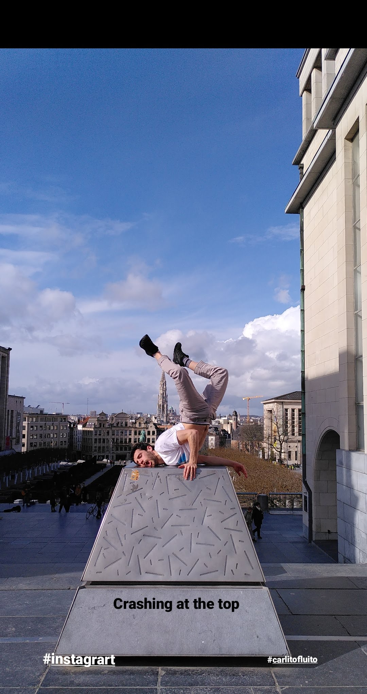
```

The idea came pretty much by itself, without the need of thinking much. I arrive to the top of Monts des Arts, pedaling with vigor and sweat as I had done many nights when I was coming back from the center with the bike. It was that hill or the hill that ends up at Place Lousie. There, I saw the tourist, I saw the tower of the city hall, standing beautifully, elegant and unbalanced. My first tinder date on Brussels, a beautiful architect that stop replying my messages, like so many others would do after her, told me the story of the architect of the city hall, and how he had decided to jump from the top of it when he realized that the main door was located slightly towards the left affecting the whole symmetry of the front facade^[Once you realized it, it will be impossible not seeing it the next time you visit one of the most beautiful European squares.]. I found the tale dramatically significative and beautiful. That guy had decided to kill himself out of perfectionism. He couldn’t stand seeing his imperfection on a daily basis, no matter how wonderful the end result was. He just jumps one day from the top of his own construction.

In my case, I just thought about the stupidity and the funniness, of a face against the rock at the top of that structure with the beautiful landscape on the background. That day, I started to use the line: *Hello, can I ask you for a picture? I am a weird guy, so, it is not a normal picture.* People find it funny, and in the case of the mother and her son that took the photo, they even complimented my t-shirt. I might be on fire that day since I was receiving so many compliments. I hadn’t carried out the marketing strategy to sell all the t-shirts that I had at home because a **Story to be told in another moment**^[S.T.B.T.I.A.M.], but it was sort of a signal from the universe that it won’t be difficult to sell the t-shirt once, I would get a bit serious with the enterprise.

The picture was also inspired by my friends from *Losin'Form Alls*, Fruta y Pera, and their joke of *“el estampao”*. I unconsciously entitled the picture, *“Crashing at the top”*, because that was the story I had lived. I had everything an average person could have asked for: a well-paid, self-managed job; a house where I could live for free; a city with a huge scene of contemporary dancers; a high-level bboy community... And still, I had felt very miserable and lonely there. I have crashed as I hadn’t crashed in all my life. I was at that top on life, and still, the forcefullness of my impact had been incomparable.

Feeling like a *Full-time artist*, I head home stopping by *Le Café Quotidien* where the friend of a Brazilian girl that I kissed in a party told me to pass by whenever I wanted because he would invite me to an espresso coffee. That guy had driven me home, together with her girlfriend, a small and cute Brazilian girl, and my crush of the night, that after kissing for a while with me started to feel the whole alcoholic intoxication.

--- *Well, I didn’t know I was such a bad kisser, what can I say?*

I helped them carry her to his car, and hold her head while seated on the back seat of the car. The guy said I was very friendly, honest, and a gentlemen for what I was doing. I just wanted a lift home and consider the night over. I had been playing psychopath at the bar, remaining serious, silent, and observant, without smiling, just making eye contact with the people and analyzing their behaviors. Interestingly, that strategy attracted many girls, almost as much, if not more than smiling, being funny, and easy-going. The Brazilian girls came, danced next to me, and a bit later, we kissed. Easy. Too easy to be true, consider what happened afterwards.

Anyways, the guy of the Pain Quotidien wasn’t there. No espresso for me. I hadn’t slept much packaging things, so taking a nap would be also a proper investment of my time. I went to the bank, withdrew some money for the float of my landlord, then go home. I left 46.07€ inside the box, because I was so rich and wealth, that I didn’t mind donating one cent to the finances of Lord. R. R.. Then, keeping the circular dynamic, I ate my last can of white beans bought in Colruyt more than 2 years ago, just with a spoon, uncooked, and straight from the can. 

```{r last-supper, fig.cap= "That studio used to have nice views...", fig.margin = TRUE, out.width = "75%", fig.align='center', echo=FALSE}
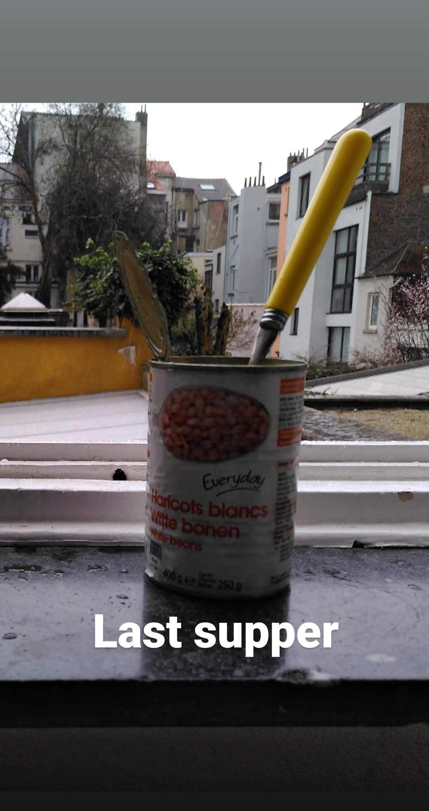
```

I always loved the feeling of being a beggar, of being outside the system, of not caring what people may think. I was eating those Colruyt cans in the office of my university as well.

```{r can, fig.cap= "If you look close enough, you can see my face in the screen.", fig.margin = TRUE, out.width = "75%", fig.align='center', echo=FALSE}
knitr::include_graphics("images/2020/Carlota/can-office.jpg")
```

Brussels did what it’s only capable of doing with the weather. After a sunny and clear day, a healing storm fell. I was trying to make my nationalistic picture with the coins from the float money when the storm came.

The picture was mostly inspired by the talk I had had with a nationalistic half-French, half-Spanish youngster studying in Brussels. I tried to explain to him that exerting physical violence (police intervention from the Spanish state) against symbolic violence (attempt of voting during 1^st^ of October in Catalonia) was unfair and disproportionated. He didn’t get nor my arguments about historical identity, neither how, according to Harari, Spain, as any other cultural fiction, was only existing in people's minds. He was only feeling heated and offended by the fact that some people had manifested violently by blocking off roads, occupying airports, or screaming on the streets. He considered that physical violence against symbolic polls was the right thing to do when the unity of a nation (a cultural fiction) was at a stake. When he asked me about politics, I told him that Podemos’ ideology next to mine was conservative and that I was a whole anti-system individual. So much, that I had already leaving the system, and motivating others to follow the trend. I was fully applying Zizek’s highest expression of violence. He ended up the conversation with few *"¡Arriba España!"* because of yes. Well, Spanish politics seems such an alien thing to me already.

```{r nation, fig.cap= "Did Instagram lower the quality enough to make the countries unrecognizables?.", fig.margin = TRUE, out.width = "75%", fig.align='center', echo=FALSE}
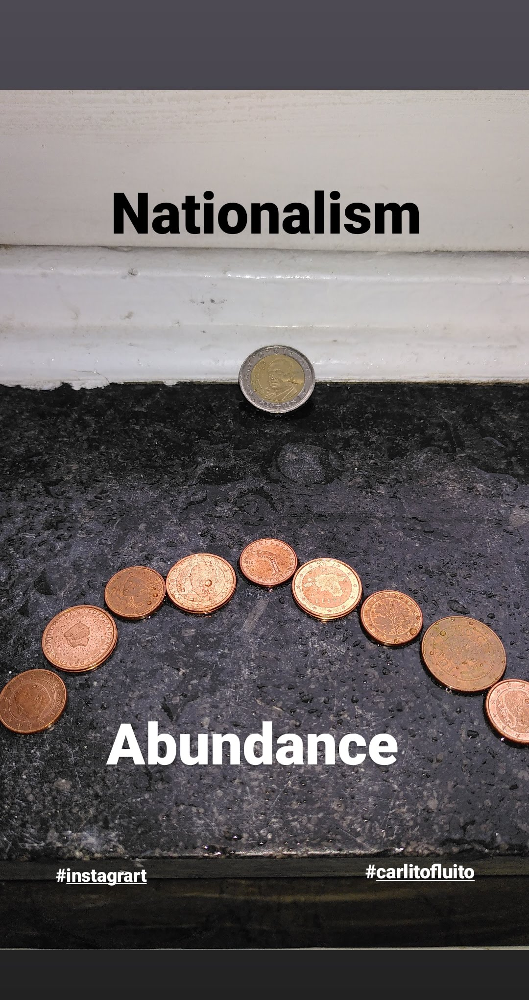
```

The storm caught me in my room, with the can of beans on my hands and some wet coins ready to be photographed. I took the photo, finish the can, and took a siesta.

I woke up a while later, remembering that I had arranged some visits for that evening.

### Circular transitions at the yoga studio

As I said to P. in the audio, a few things happened when I went to the yoga studio where I used to work to give back the key I had found while ordering my room. The one I had been trying to take there for more than a year. Once I left the house, I went to the foreigner’s office to unenroll from the Belgian system. There I met a Spanish dancer and I told her to contact K. and ask him about the list of dance spots in Brussels I have done at the beginning of my time in the city. I waited in vain because I was supposed to go to the commune. I went there, and whatever the negative things people can say about Belgium and its organization, in my personal experience, bureaucracy has been pretty smooth pretty much all the time. Entering the building, taking a ticket, waiting a reasonable amount of time, going to the desk, and having the issue solved in just a few minutes. Simple and effective. Coming from Spain and its style of *Did you brought this and this paper...? But you know that it is not here where we do this procedure, you have to go to this place... Yes, sorry, now it is closed, it is holidays...*; I found Belgium quite resolved.^[Nothing against Spain though. Lovely people.] Thus, in less than 15 minutes, I was out of the system.

```{r bureau, fig.cap= "Sometimes I get surprised with my levels of stupidity.", fig.margin = TRUE, out.width = "75%", fig.align='center', echo=FALSE}
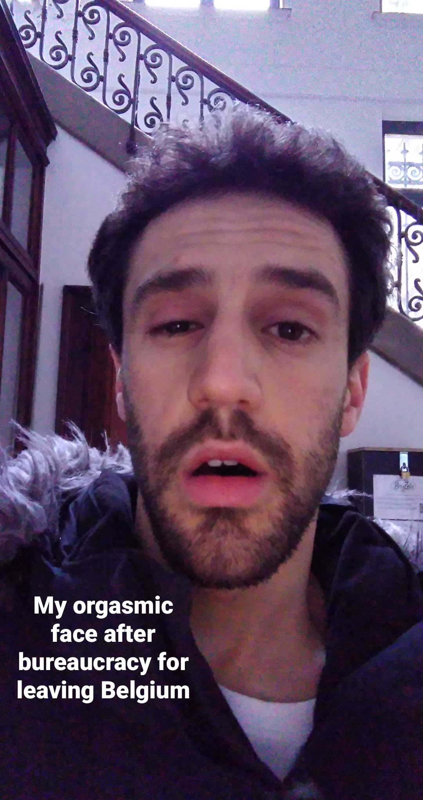
```

I head towards the post office and I joined the laughs of the attendant at my original way of packaging. I spent 13€ to send a small box to a friend in the UK. Considering that I had sent two boxes of 30 and 35 kg to Spain that same morning, the price of that package was ridiculous, but you may have heard already about previous experiences with the Belgian post services.^[One of my classical posts... [It's not that much](https://www.carlitofluitoideas.com/its-nothing/)] At this point in life, I have the money. I didn’t complain. I paid, and I let it done. Easy. 

I felt lighter after the package was taken and the bureaucracy finished. Everything was going downhill. I took the bike that was still mine, and in a metaphoric way, I went from Port de Namur to the Theater of La Monnaie, the road I had taken so many Sunday mornings at the beginning of my period in Brussels when I was waking up after 5 hours of sleep because I had to clean the bar at Hard Rock Café until 3 am, and then give my yoga lesson at 9 on Sunday morning. I don’t buy that bullshit of working hard for other people and struggling to reach your goals, and those modern coaching messages of empty motivational quotes. However, I can say confidently that I have earned my position outside of the system. The bike was fast. It was the first time I was taking that route with that bike. All downhill, just being careful not being hit by a car and braking before the curves. As always, creatively and dangerously ignoring traffic signalization of all kinds, and arriving at my destiny in less than two-thirds of the estimated time by Google maps.

At the entrance of the studio, I left the bike unlocked outside. I took the key from my pocket, and to the surprise of the girl seated at the desk of the reception, I locked the glass door from outside. I just wanted to be sure that it was the right key and not another one from somewhere else. I unlocked the door and entered the place to the surprise of the people there, explaining out loud that I used to teach there more than a year ago. Indeed, it was all quite symbolic. That place had been one of the first jobs I got in Brussels, if not the first. It had been one of the places that had treated me best, and the solidification of my role as a paid yoga teacher. However, once I started with the Ph.D., I had to stop giving lessons, because it was in conflict with the contract from my university^[It is **LI: E** at Kostas’ kitchen clock. I am writing because I am doing it for myself, if I had to work for something of the university, I would have likely go to sleep. That is the difference between working for yourself and doing it for others. That you can do it at your own tempo. In my case, drinking some Darleejing tea, eating some lentils with rice, and typing in this laptop in Muster at **6I: E**. Time flies.]. As, I explain to P. in the audio, it was the key that was closing the cycle, the first and the last job-related thing I was doing in Brussels.

Once inside, the volunteer at the reception was a kind and affable Greek woman. I explained to her the situation with some more details, and then I took a glass of tea and looked at my smartphone while I waited for the tea to cool. I had posted my video crying on the room on the feed, breaking all the nice patterns that I have gotten thanks to my collaboration with B. and M. on the social media. Thus, I made a screenshot and the story *My life is broken now*. In a video where I am crying, people may think that my life is actually broken. However, I was merely referring to the brokenness of the Instagram feed, which for some people it actually represents their life. Anyway, the whole thing looks weird and messy now, but I don’t care. I will fix it at the right moment. In any case, more than broken, my life was getting recomposed.

```{r broken, fig.cap= "So much effort on having a nice Instagram feed, and now it's is all ugly and inconsistent. Shame on me.", fig.margin = TRUE, out.width = "75%", fig.align='center', echo=FALSE}
knitr::include_graphics("images/2020/Carlota/broken.jpg")
```

Most of the yoga students went to their classes and the Greek receptionist and I were kind of force to interact. It was a yoga studio, so normally we understand each other, and we are alternative, spiritual people that are not going to get judged as it might happen at Luxembourg square. She started the conversation with a typical accepted question: 

--- *What are you doing in Brussels?* 

I quickly made the conversation atypical, as I always do: 

--- *Well, I am leaving.*

--- *Are you traveling or something?*

--- *No. I was working here two years ago, so I have been living here for two years and a half already.*

--- *Then, what have you done in Belgium during this time?*

That was the question I couldn’t answer at that moment. When I face difficult questions that require complex answers I usually take my time to came up with a satisfactory answer in terms of length and accuracy. For example, once someone asked me why I didn’t like Belgium, and I answered that we didn’t share the same values. In the yoga studio, I didn’t want to come up with any thinking process, and since my impulsivity and spontaneity were fully functioning, I answered:

--- *Life, life, life, life… Actually, there was quite a lot of life.*

I hadn’t verbalized yet how much I have lived in Brussels during this time, and it is undeniable that in two years many things, many people, many processes, many moments, many situations happened.

--- *Okay*, she answered. *And where are you going then?*

--- *Well, I will do a small tour around Europe visting some friends. But the final destination is Lusaka*.

--- *Lusaka? I don’t know where is that.*

--- *Don’t worry, I didn’t know it either until I check. It’s the capital of Zambia.*

--- *Zambia? That is Africa. *

--- *Right.*

--- *And what are you going to do there?*

--- *Similarly, what could I say… Live.* 

She laughed.

--- *Well, I am afraid I need some more specific information to understand.* 

I laughed as well. I tried to be as concise as possible: 

--- *Dancing, writing, explore my consciousness and study other’s consciousness.* 

She seemed intrigued, but she clearly understood. 

--- *I see, so you are planning to build a project there.* 

--- *That is correct. *

--- *Well, that looks nice. I hope everything goes well with you. *

--- *Thank you. It has been some intense period. If you have some social media, you can follow my trip. What is your favorite app for distant communication? I have all the apps.*

I was wishing she said Instagram. 

--- *Hmmm. Instagram could be fine.*

--- *Perfect. Then you write “Fluito”, and you should be able to find me. I have been uploading many stories about these days, packing and all that. Now they are gone, but I will make a compilation with the best moments for YouTube.* 

--- *Hmmm. Wow, spiritual psychologist, that sounds deep.* 

--- *Haha, sort of. You know exploring the consciousness and all that.*

--- *I like the “Non-Ph.D.” thing. So, you didn’t finish your Ph.D.*

--- *Well, I didn’t. I wrote it because of Zizek, do you know him? It is a Slovenian philosopher that uses an example about the living and the death, and how the non-death is this space in between. They are not dead, but they are neither living. They occupy that space in between and that makes them from a different category. It is this idea that the negation of a characteristic that forms part of the identity of the object. Something like this. I don’t understand much of philosophy. He even gets more complicated with the negation of the negativity, because it is the non-death. In my case, it is just that I am a non-Ph.D, I point out that I don’t have a Ph.D., but it is not merely that I don’t have a Ph.D.; I have a non-Ph.D.*

--- *Hahaha. Interesting. I see. So what was the topic of your research?*

--- *The effects of nature on morality.*

--- *Sounds cool.*

--- *Well, it sounds cool. But then, it is a different thing. People outside academia think that having a Ph.D. is very cool and that we are very smart or something like this. Well, I am not. I think that the job is easy, but I cannot say anything because I didn’t finish. Anyway, the thing of doing a Ph.D. is that it is a bit reiterative, always about the same topic, small field, and then big conclusions. My mind is not done for that, I like big ideas, mixing things, stretching scientific knowledge and try to link it with spirituality. That is more interesting for me. I accepted my nature, and that is what I am good at. I don’t want to be in an office, looking at the screen and all that, system, system, civilization, society…*

--- *Yes, I understand.*

--- *Thanks.* Enough of my ego. *Sooo, what are you doing in Brussels?*

--- *Well, I am planning to enroll at the university.*

--- *Coming back to the system...*

--- *Yes. I have my doubts because people are young, professors sometimes are difficult and all that.* 

--- *I know, I experience that very much myself. Also, office job, no nature, no movement, in front of a screen all day, closed space… You understand why the non-Ph.D. I guess. My body needs to move, I need to dance. For example, I was noticing before that just in this room there are probably more plants that on the whole floor of my university building. I have been reading lately about civilization and we are living in a very badly designed environment. I like to put a kids’ example of five monkeys locked in a jail and hungry for several days without eating. If you threw a banana, we both know what will happen. But if the same five monkeys are free on the jungle, plenty of bananas around, it is likely that they will cooperate so they can get more bananas. It is the same with human beings. You put them in this society, and of course, people get depressed, burn out, loneliness and blablabla. Even, I recently realized how spirituality and positive psychology are being used by the system.*

--- *Spirituality, what do you mean?*

--- *Yes, you know, all this rhetoric of you can do it yourself if you work enough, believe in your dreams, work hard to get to your goals and all that. I think it is very isolating and against human nature. It makes people sacrifice relationships for working hours. And then spirituality, which is a wonderful tool of self-exploration and introspection, is used to blame people for their own emotions. Ah, if you feel like shit, it is not a problem of you working all day, being locked in a car while you are commuting and not seeing your family. No, it is that you complain too much and that you don’t understand yourself and your emotions. Fuck, no! That is not the problem, it is the problem of the system.*

--- *Hmmm. I see.*

--- *But yes, what about your university? You will meet some people. At least it won’t be so isolating like a job in front of a screen the whole day… *

--- *Yes… But the students at the university, they are a bit too young. Only party and that. It will be a bit weird. *

--- *Yes, yes, for me it was the same. I was in Louvain-La-Neuve, so you can imagine… And what are you thinking about studying?*

--- *I am doubting between physiotherapy and kinesiology. *

--- *Uhhh, that sounds cool. Also, you will mix it with yoga knowledge. *

--- *Yep, I would like to combine it for later when I become a yoga teacher. *

--- *That is nice.*

At some point, a friend of hers entered the studio. After greeting each other she introduced me: 

--- *This is Carlito… Flurito?*

--- *Hahaha, yes! Florito!*

--- *He is a super-interesting guy. *

--- *Come’ on. I have been here just for 7 minutes and I spent 5 of them standing there looking at my smartphone. *

--- *He is going to Africa to do something about psychology and spirituality, and also he dances.*

I try to maintain myself in order and avoid any type of extra bragging, humble or not. The two friends started to talk to each other, catching up. I checked the phone, answered some messages. Then, while the Greek woman ordered and get ready to close the studio, I briefly talked with the person that had just arrived. She praised my “Truth is non-violent” t-shirt, and I told her that it was the Carlito Fluito merchandising. 

--- *I don’t have a job anymore, so….* 

We left the studio, said goodbye, and reminded them, that I would use Instagram to keep the tack of my journey if they wanted to check. We said goodbye with a hug, and I confirmed my prejudice about how easy and smooth it is to interact with people that are in a "*higher level of vibration*", the type of people you are likely to meet in a Yoga Studio. Then, I head home. Send some voice notes to P. and took the "*Crushing at the top*" picture. 

### Tearing my soul apart

Due to the guy of the package had arrived quite early, while I was about taking a power nap at my place, I was liberated to do the errands that I needed to do before departing Brussels. I was very lucky since the package was picked up at about 10 am, and it was scheduled from 8 am to 8 pm. Thus, I used the momentum to finish up Mortimer’s tale. I wanted to express the image of the cypselae flying, and I rewrite it a couple of times. When I thought it was done, I read the whole thing out loud in the solitude in my room, and I couldn’t contain my tears. I didn’t know where they were coming from, but there they were.^[A. had asked me if I wanted to cry when I was with her in Estonia, and I had answered that I wasn't sure. She had asked me when it had been the last time, and I told her that it was during the summer, when I saw the episode of Black Mirror where the protagonist highjacks a worker of a social media company(*Smithereens*). It is devastating to realize that the episode is dated on 2018 and we are already living in 2020. So far away from our human nature.] I looked at the window and I saw the tree and the buildings that I had been watching for two years and a half. An image that I would likely not see again in this life, or at least for a long time. It was sunny, there was the sun, there was life, it was beautiful. A feeling of sadness mixed with liberation and release, together with the admiration of the beauty of being alive; and the imagination of the cypselae floating around the tree in that ephemeral dance; and the shared pain of the dandelion for not wanting to acknowledge the wonderful existence and moment that it had created; and the fact that R. hadn't come to the goodbye gathering with the flatmates because he probably kept on thinking that I was ungrateful and pathetic for not staying at his place for one week more; and all the suffering I have had during the last month; and all the good moments I have lived in that room; all the things I have learned and how I have grown in that city; to acknowledge that I was closer to my death, but filled with life… It all mixed up in my brain, making me unable of processing anything other than the view of the window on my visual cortex. I was crying and I took the phone almost instantaneously and recorded myself. So deep. So pure, so real, so irrepressible, so inimitable. That is the type of content no one dares to upload to social media, but at the same time, the one voyeurs followers of reality shows seek with such compulsion. There they were; my true, real tears. The ones A. hadn’t gotten. A gift for all of you human beings. For all of you, my people. There they were. Enjoy them.


```{r insta-video, fig.cap= "I need to cry more often... Click [here](https://www.instagram.com/p/B8_M7WiB4SV/) to see the video.", fig.margin = TRUE, out.width = "75%", fig.align='center', echo=FALSE}
knitr::include_graphics("images/2020/Carlota/video.jpg")
```

Some words came to my being. Words of truth because “I hear you sing M., I heard you sing”. At some point of enlightenment, people stop talking to start singing. The words just move smoothly, floating and dancing throughout the air, with rhythm, with sonority, with charm, with love. Then, you can trust, those are words of truth, those are words of life.

> If they ask you whether you are laughing or crying, don’t let know. Don’t let them know, because you don’t know. Don’t let them know. 
> 
> They may ask you why? 
>
> --- *Well...*, you can answer, *I don’t know.* 

I had been cleaning, so I was wearing that girlish purple t-shirt with a purpurin heart in the chest pocket. I couldn’t contain the ridiculousness and spontaneousness irony of the situation. There I was tearing my soul apart, sharing it with an infinite audience, and dressed up in my most unprepared clothes. And still, so real, so true, so genuine. 

My heart, my heart to you all. Thanks for being.

After emailing the tale to S., I head outside home. I had to go to the post office and the city hall. I didn’t have much time to lose.

### Waiting for the transport guy

I had to spend all morning at home. I woke up at 8 am, just in case, and I walked Mortimer with the feeling that the transport van for taking the package could arrive just at that point. In that case, it was more likely that any of my flatmates would be leaving home for work, and thus speak with the transport guy. I came back with Mortimer. I hadn’t slept much since I had been packing and cleaning until late night. The estimated time was from 8 am to 8 pm.  Not the best. I was feeling confused and tired. I wanted to sleep but there was much to do. At the same time, I was feeling unrested since I was always worrying that the guy would appear at any moment and I would miss the doorbell. Thus, I spent most of my time eating and playing with Mortimer. Those were probably our last moments together. I had taken a picture of him and a dandelion during the walk that I would add to the tale I had written the previous day. I was leaving, and I wasn’t sure whether that dog was aware of it or not. He would surely miss me after two years of waiting for me to be walked, feed, or licking my feet. I gave him the love I had had to dose for so long. I massage and pet him, let him play with the ball, and made some runs around the hall of the house. It is an old dog, but he also deserves to have some fun. Luckily enough, when I had decided that I would take a short siesta, the guy of the transport rung. I helped him leaving my packages at the van, and I told him to put them in a flat position instead of vertical. He didn’t care much and I was wishing that all that material stuff would arrive as safe as possible to Spain.

```{r mortimer, fig.cap= "Everyone is on the pic. (Re-read the tale)", fig.margin = TRUE, out.width = "75%", fig.align='center', echo=FALSE}
knitr::include_graphics("images/2020/Carlota/mortimer.jpg")
```

### Previous days

As everyone’s my story doesn’t finish the morning before leaving, neither the previous night. It doesn’t finish in me leaving my office for the last time or speaking about who of my colleague is going to come to Zambia or the moment I realized I am going to reincarnate in a tree. It doesn’t finish when I wrote Mortimer’s tale. It doesn’t finish with the serious conversation that I had with S., or with my unproductivity on the university even though I had taken the methylphenidate. It doesn’t finish Sunday when I smoked a joint in front of my smartphone and I danced upside-down climbing walls in the middle of the street. It doesn’t finish in any of the stories that are yet to be told.

Actually, my story doesn’t even finish in the present moment, while I am writing this line. This moment is the present, current time where the story is right now, and the more we move backward, the more we would advance towards the past, not towards the end of the story, but towards the real beginning. Is it the beginning of my story that dawn of September 1992, when my body left the womb of my mother with a couple of knots from the umbilical cord on my neck due to (or maybe causing) my neuroatypical brain? Does maybe my story begin the moment the lucky spermatozoid of my father reached the egg of my mother? Does maybe my story begin in any of my previous lives? Or does it begin back when the grandfather of my grandfather was surviving to the Spanish Carlists wars? Maybe the day the Arab with my surname, *Alcalá*, met the Spanish woman that would spread his foreign family name? Or maybe back to the days where the small group of hunter-gathered Sapiens my ancestors used to belong to establish themselves in a city, willingly or unwillingly, and started their contribution to civilization? Maybe when that branch of new world neotenies apes started using language, tools, imagination, and symbolism to cooperate with each other more efficiently? Maybe the day an asteroid hit the planet-killing species that had survived millions of years and changing the biological hierarchy of the ecosystem? Maybe even before when the first legged fishes venture outside of the seas exposing themselves to lethal levels of sun radiation? Or when the cells grouped themselves in primal jellyfishes? Or the first act of love and cooperation known in the biological animal when a prokaryote cell realized that hosting a fellow prokaryote was to his long-term advantage? Maybe the moment huge masses of atoms got attracted to each other forming a floating and flaming rock located at the right distance of a medium-size star at some place of an endless universe? Maybe back on the moments when the universe expanded at the speed of light, cooling off its vibration and increasing its size? Maybe before? Maybe the day S. coined and shared the nickname Carlito Fluito with me during her trip to Belgium in 2014?

I don’t know. 

Much in the fashion of Memento, by Christopher Nolan, this is a tale narrated backwards and forwards simultaneously. I started registering my life more systematically by sharing my mind on letters back in 2013. Since, then, I have collected more than a thousand pages of written thoughts coming from me and from my friends. Considering the length of my letter, I guess that about six or seven hundred pages are entirely written by me. I have many projects to write, many [*Unfinished books*](https://www.carlitofluitoideas.com/unfinished-books/), and time is pressing every single day. 

I struggle with publishing, editing, formatting, and typesetting. I would love to have a team that would allow me to focus exclusively on the creative process, without getting distracted with practicalities. Till I found it, I will keep doing my best. Forgive my flaws and mistakes, be compassionate, and if you believe in me and my words, help is always welcomed.

Just to give last words of conclusion, the lesson I had to learn at this point in my life was **letting go**. It has become clear to me, especially since the last summer, [when I met A.](https://carlitofluito.github.io/A/). I surrender my whole self to the universe, lying down next to a devil, and I assumed that I would walk away, leaving aside all those things that weren't meant for me. I was ready to leave the Erasmus Exchange, to let it go. Later on Estonia, I learn, forget, remember, and obviate that I had to let go of A.. Finally, after months of suffering and, at least, two years of bumping against the same wall, I took the decision that I had to left the Ph.D. and my life in Brussels in order to pursue something else, something more meaningful, something full of love.

Writing this letter has been one of these things I was supposed to do. Here it is. The rest, are just stories that would be told at the right moment. Stay tuned, support and spread.

Love to you all, my people. Life is happening, the future is coming, and it is going to be wonderful. I can sense it.

Trust, believe, and you’ll see.

Love to you all, my people. 

Carlos Alcalá, a.k.a. Carlito Fluito


## 2020-03-09 Ohm Namae

This is a brief text I wrote on the Flixbus from Amsterdam to Berlin, after taking some plant medicine (psilocybin), and discover how much of *f\*cking talking monkeys* we are; how we like to be *cuenti-cantinelas*^[low-range same old story-tellers]; and how wide and infinite is the knowledge held in ancient religions and traditions. 

Understand me as much as you can...

2020-03-09

23.19

Lo saben todo. Lo saben todo. 

No lo sé. No lo sé, no lo sé, no lo sé. 

Ya está, ya está, ya está, ya está. 


Mi camiseta de tirantes huele a cacao, a cocoa. 

No se nada. No se andar. No sé hablar, no se escribir. No sé nada. 

Ohm Namae Shivayae. 

Give it to nature because nature receives it it all. All all. all. 
Give it to her. Ohm Pachamama. Love love love love love. 

Ohm Pachamama. 

Love, love. 

Pranayama, pranayama. Because they know it all. Ohm ohm. 

Fractales de colores. De colores, de colores, de colores. Se viene de colores.

Ohm shivaya. And talk with the snakes. 

Give and take, give and take, give and take. 

Gift, gift, gift, gift, gift. 

Give and take, give and take. 

Make it circle, make it circle. 

Ohm namae, namae. 

Infinity and eternity. 

The now is always here. Don't worry much about it. 

Always, always, always, always. 

Experience to be able to communicate. 

Only communicate what you experience. 

Avoid communicate when you experience. 

Comunnication avoids expirience. 

My curse. 

For the apple, for this life, and for this reencarnation. 

La lanza de Jesus en el costado por una civilización descreyente. 

My prayings, my prayings, my prayings to you all. 


Coming back and landing, coming back, coming back, coming back. 

Asolidaje en la tierra. Asolidaje. 

Por Ra, por Ra, por Ra. 

Herido de ciivilización. 

Todo, todo, todo, todo. Todo está dentro de tí. 

Hasta que cantes mantras en Amsterdam, y te dejen cantar mantras en Amsterdam. 

Fuck rules. Fuck rules. 

Lo saben todo, lo saben todo. 

Time to tantra. 


```{r namae, fig.cap= "From right to left: the artificial fur of my North Face coat that cought fire two days after I bought it in Copenhaghen (2014, check letters); the metal bottle of water that A. the frutarian gave me as a gift on Amsterdam (2020); a microphone tripod that I use to put my phone when I film myself dancing; a coconut cup from the cocoa ceremony at [Odessa Amsterdam](https://www.odessa.amsterdam/); inside the coconut cup, a worn-out, almost transparent sleeveless shirt I took in my trip to New York City with M. (2013).", fig.margin = TRUE, out.width = "75%", fig.align='center', echo=FALSE}
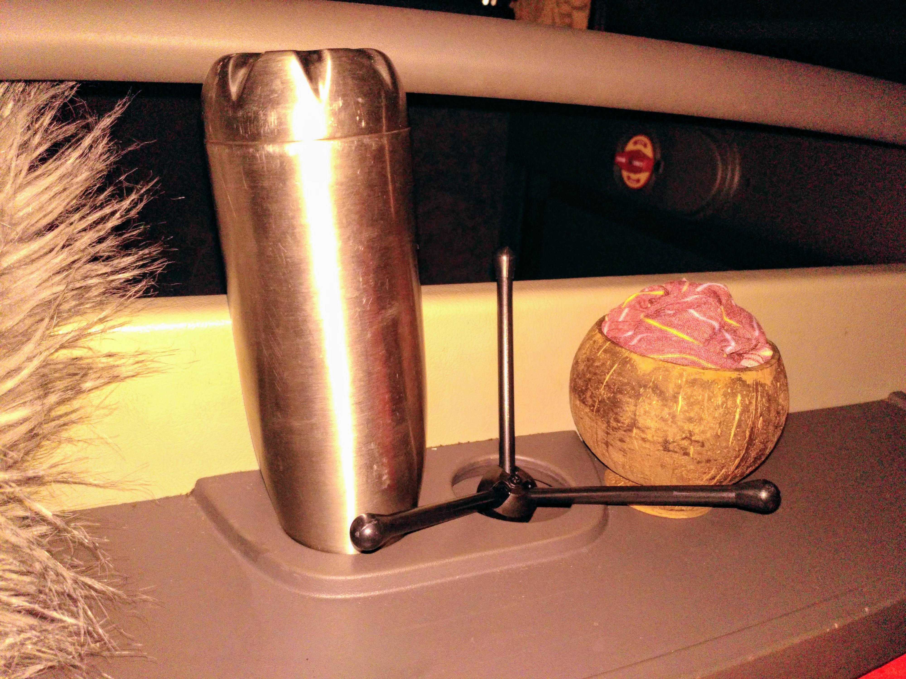
```


## 2020-03-10 To P.

3.45

According to Flixbus

Te voy a escribir un poco, P.

Con calma. Sin prisa. 

La magia no ocurre por mí. Ocurre a través de mi. 

Tú esto ya lo sabes. Porque lo sabes todo. 

Lo saben todo. Lo saben todo. Y yo, no sé, no sé, no sé, no lo sé. 

Todo está diseñado al milímetro. Al milímetro, para mí que la perfección nunca basta. 

Cada breathe in, cada breathe out. Cada espacio in between. Cada momento de kumbaka, y cada liberación de rechaka. 

La psilocibina cura. Cura, cura, cura mucho. 

No sé si estoy haciendo una prograsión ordenada, o es que a partir de ahora todo funciona así. 

No sé si me voy saltando de cien en cien los niveles, o si es que a partir  de ahora todo funciona así. 

Me gusta que estoy escribiendo despacio. Que me permito hacer frases-párrafo. 

Me he sacado el título de Ph.D. una semana más tarde de acabar el de non-Ph.D.

El universo cuida mucho de nosotros, P.. Mucho, mucho, mucho. 

Las pocas arcadas que controlo con la psilocibina, se convierten en una llorera. Una llorera que está muy, muy, muy, muy reprimida. 

Deep, deep, deep, deep, deep. 

It's coming, P., it's coming.

Let it come, let it come.

Amor, 

## 2020-03-23 To Paloma

2020-03-23

Hola Paloma, 

Or any of the other people that read, because I know there are other people. 

Corona times require Corona measures. And I write like this because I know I can. 

*Cartas a Paloma*. But it was everyone but Paloma the ones that were reading them. 

Today I thought about doing the [*6 phase mediation*]( https://www.youtube.com/watch?v=EaRu14P9H84) of [Visen Lakhiani]( https://www.vishen.com/), but in a longer format. Instead of 20 minutes, it could last 2 hours. Instead of not even 5 minutes by phase, which would be 30 minutes, to do 20 minutes by phase, which would make 2 hours. Then, I thought I could start recording myself guiding the meditation^[Sorry, not available at the moment. Looking forward your collaboration, though.] with only 10 minutes per phase, summing up a total of 1 hour of meditation. Because now that we all have free time and we are lock down, we can allow ourselves to meditate 1 hour in the morning and one hour in the evening. 

>Corona times require Corona measures

-	Why are you always saying the same?

>Because if you have time, meditate one hour. If you don’t have time, meditate two. 

-	Don’t you know that this is not the way you are supposed to use speaking marks, and hyphens?

I don’t even know what a hyphen is. I just know how to write, and wait for my editor to come and fix my mess. 

-	You mean an editor male, or an [editor female]( https://carlitofluito.github.io/unfinished_loves/)?

> I mean Joselyne^[True, this letter is not published yet, either.]

How often can I reference an unfinished text? And how good strategy it is to leave the links already done, even though the content hasn’t been created, because in this way the job is already structured for the future. Working in the present for a future that should have been built on the past. 

Not bad. Not un-understandable, but neither understandable. [I rather not to]( https://medium.com/@mdowns1611/i-would-prefer-not-to-%C5%BEi%C5%BEeks-bartleby-politics-12bd8d9de66a) over-complicate myself. I am trusting too much in a non-changeable internet. And I should may want to keep the copies of my thoughts on my laptop as well. However, unluckily for me, the internet is much more reliable source of preserving and retrieving the information. As for today. 

I think it is the perfect moment to go to Nebenau. A village in the mountains, away from the empty cities, and the crowded cages. The metaphor of the 20 century used to be of monkeys behaving like sheep. However, that seems a bit antiquated for me^[Don’t you enjoy understanding *antiquated* just because you are a native Spanish speaker, and that some natives may have had to check whether that is a word or just the fucking low-range writer creating words?]. Antiquated is to think of Sapiens as sheeps, instead of thinking of them as monkeys. A more updated view of *f\*cking talking moneys that don’t understand each other* is to think that they are hamsters trapped on their cages. Comfy cages, comfy hamsters. But f*uck, they found a wild a beast that is going to difficult to tame. 

I always liked to see myself as a fox. Then, [a girl we have in common]( https://carlitofluito.github.io/letters2013_14/) compared me with a squirrel, even with a lizard. Our lovely V.. She taught me how to read, how to breathe, how to kiss, how to cry, how to hold a hand, how to say goodbye. She taught me how to write. Even how to give a face massage. 

So many more to come. So many more, I may forget. Or may not. If you only have one mother and your mother dies, do you suffer more or less than if you have more than one mother?

It may be too late for me to have more than one mother, but may not be late enough for my kids to have more than a father. If you have lost track, [ask Ryan]( https://en.wikipedia.org/wiki/Sex_at_Dawn). I rather quote on my way, than on Bookdown’s way. But for the shake of science, I do it because I can [@ryan2010sex]. And because I can, I can even cite texts that I haven’t read [@saxon2012sex], like a good scientific that I am not. 

Carlito Fluito, non-Ph.D. 

Because I can. Because I don’t have to sing anywhere explaining people what I do and what I don’t.  Because, I am free. And because if every Spanish that stays at home during the quarantine doesn’t receive 100€/per week, I will have to make your time worth at least as much as you are not earning for your normal investment. 

I am writing and publishing guides. I am filming myself, but not uploading it yet on the social networks. I have [YouTube]( https://www.youtube.com/channel/UC5Q8igPq_lE1JQNwbjjy7wA), and [Instagram]( https://www.instagram.com/carlitofluito/?hl=en), and [Facebook]( https://www.facebook.com/CFluito/), and [email](emailto: carlitofluito@gmail.com).  I have so many things that I often forget that I also have [Patreon]( https://www.patreon.com/carlitofluito). Patreon and a bank account, more empty than full, but more full than empty. I just miss feedback. Because, if no one tells me what they like and what they know, I may think that everything I do is equally good, and ending up puking my narcissistic gluttony. Vomiting Narcisos. 

It would be a good moment for adding a picture of a Narcisus, but then I would have to download the photo and adding it to the folder. The question is, how long does that operation takes?

00.52

```{r narciso, fig.cap= "00.54... Click [here](https://en.wikipedia.org/wiki/Narcissus_(plant)) to know more than me about what I talk.", fig.margin = TRUE, out.width = "75%", fig.align='center', echo=FALSE}

```

Just kidding, this is the picture I wanted to add: 

```{r narcisus, fig.cap= "00.56... I don’t know anything about [this]( https://en.wikipedia.org/wiki/Narcissus_(mythology)) either.", fig.margin = TRUE, out.width = "75%", fig.align='center', echo=FALSE}
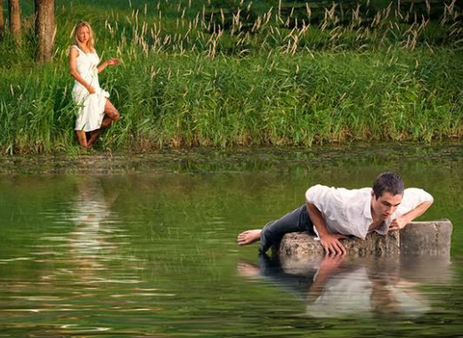
```

Although [Carvaggio’s]( https://en.wikipedia.org/wiki/Narcissus_(Caravaggio)) is best, not in the [Online Open Prado’s Museum Gallery]( https://www.museodelprado.es/en/the-collection), but in the [Galleria Nazionale d'Arte Antica]( https://www.rom-museum.com/galleria-nazionale-darte-antica.html). I wish I could visit it now that I am locked at home. I would buy a huge TV, just to put my favorite paintings over a glass of wine. 

However, I prefer to hang and admire the creations of my brothers, sisters, and relatives. 

At some point, I lost the point of what I was talking about, and got trapped by the stream of connected information. Was I talking about Narciso the flower and our infinite ignorance about the botanic world we have grown so disconnected from? Or was I talking about Narcissus the Greek myth and how disrespectful we are of ancient classics? Or was I talking about how little time we have to stop and admire great works of art? Or was I talking about my drowning Narcissism and [how mine](https://photos.app.goo.gl/mmSReR8LBzadyNqbA)^[This one I don’t upload it to YouTube, so this video can only be seen by those that read the letters. Not the followers, not the believers, the readers. A very specific category within my audience. Exclusive audiovisual content for you, my lovely readers.] is just an expression of a societal movement downwards? 

The only Narcissism that I really liked is the one that is shared. It is the one when I dwell when I find eyes that want to sink to mine to find theirs. The eyes that want to hold my gaze. Those that are deep enough so I can blindly fall and dwell. Those that promise me that whatever the depth, they will hold, because they held. Those are the eyes where I want to sink. That is the  mirror, where I want to find my pains. 

But fears, you know, I know, we know. We are afraid of connecting a bit deeper with reality, with ourselves, with each other. We feel attacked, and exposed, and vulnerable when we hold our gazes and instead of fighting each other armors, we play getting naked, from inside and from outside. We lack so much love, we are afraid of being vulnerable. So sad, my friends, so sad. That is why having a mother is probably not enough. And having a tons is probably the healthiest love. It is not that no one should stand our anger. It is that kids should be raised with the fantasy and the magic that love is endless, unconditional, and unlimited. People are humans, but communities can be divinized. After [Nietzsche]( https://en.wikipedia.org/wiki/God_is_dead), humans are unable to divinize gods themselves. He suggest that we [could divinize ourselves](https://en.wikipedia.org/wiki/%C3%9Cbermensch), but he didn’t mention that we can divinize communities. 

Corona times seems a good moment to catch up on philosophy, if that is what you are into. However, you and me, Paloma, being spiritual as we are, we are likely to catch up on nature, now that is Corona times. But unfortunately, we are obliged to be locked at home. Because we got too late, and our homes are not in the nature. Be patient, Carlos. It will come. For the next pandemic, I will just have to limit the number of people that contact the members of the community, and we will be safe from the [antibiotic resistance that meat eaters have developed]( https://www.reddit.com/r/vegan/comments/fat9ur/earthling_ed_shows_how_people_should_be_more/). I am not sure if I am overloading the text with references. But I like the idea of giving people some extra knowledge if they are curious and they want to explore a bit more what I mean with my texts. 

I used to like it when it was uncleared and mysterious, but obviousness is the norm. Funny fact, by 23^rd^ of March of 2020, when you write “*Obviedad*” in [Google translate]( https://translate.google.es/#view=home&op=translate&sl=es&tl=en&text=obviedad), it translates it as “*no-brainer*”. I prefer “*obviousness*”. I think no-brainer is something different. That is why I just gave feedback to the machine. 

Paloma, it is 01.23, and there is a routine to develop and refine. Let’s dream. 

-	I wake up at 6 and I spend 2 hours doing the *6 phase meditation* of Lakhiani at Fluito’s speed. 

-	I do some mobility because my body was complaining so much during the meditation that I am unable to skip my *movement awakening routine* any day of my life. 

-	Do today what you are going to repeat tomorrow. 

-	I have had had brushed my teeth with the left hand, and make some wudu, because it is impossible to meditate when you are falling sleep. 

-	If I was falling sleep, it meant that I hadn’t slept enough. Thus, I go to sleep again. 

-	Or maybe, I resist the impulse, and wait till the night, to regulate my circadian rhythm. 

-	But it is night and I want to write to Paloma, because there have been many days since I haven’t written anything to you. And you have asked me to write you. 

Such a dilemma. 

The good point of this routine is that I have all the time I want and need in my life at the moment. So much time that after meditating, I have time to do breathing exercises, and even train some dance, and even write and publish my texts. 

Corona times are bringing tons of opportunities. 

How are you doing in Spain?

C.F.


## 2020-03-25 To you, reader

2020-03-25

Hello reader,

This lack of focus is just some shit I have not gone through. The people that didn’t answer whether they want me to publish [the letters that they sent me once]( https://carlitofluito.github.io/letters2013_14/) are considered already outside of my life. Publishing their words is the consolidating ritual to interiorize that they are gone. That they are not going to come back. 

There is bereavement in understanding as dead those that are still alive. In a solipsistic thinking, I will assume that whoever I don’t experience is subjectively dead. I include technological mediated communication as a form of manifestation of one’s existence. Even including those categories and forms of expression such as a Facebook or WhatsApp message, many people of my past seem irremediably dead. Not my problem, since I remain narcissistically alive. 

Luckily for me, I just remember about them when I suffer from loneliness, alienation, and purposelessness. When I share the bed with new or old bodies, I forget about whatever my past was, and whatever my past is not anymore. I focus on the present, doubting about the future. 

When I re-read my recent texts, I think I am becoming a better writer, since I tend to dislike those of the past. I used to overcomplicate the simplicity. Nowadays, I oversimplify the complexity. I always lacked from a trustful editor to tell me how to find a golden balance. That golden balance that [got me expelled from the Vipassana]( https://www.youtube.com/watch?v=l17lZ2T-zWE). It means I am not improving much, just moving from side to side. Sometimes more erratically, sometimes less. 

We could picture a wave making peaks and lows. From one extreme to another. Big and high like a radio wave, trying to become a gamma ray, with laser-like precision, without much amplitude modulation. Raising my vibration, in case metaphors still apply to these aspects of life. 

Science forgot that humans’ psyches work best with metaphors, stories, and legends. It came to impose its truths, forgetting about the computing power of the hardware it tried to update. The psyche is the hardware in this case. Information such as the size of the universe, and the dual behavior of nanoparticles are too advance for the code that is currently running. It is like trying to mix to computing languages, or like asking an old computer to operate with the newest software. Our psyche is old, old as time, and old as evolution. The new information brought by science is often too much for our minds, and that is why we tend to reject it, or even worse/better, adapt it to our limited psychological structures, so we can use the terminology freely, without big feelings of guilt or remorse. The universe has messages for us.

I have forgotten A. during the third phase of [*The six phase meditation*](https://www.youtube.com/watch?v=EaRu14P9H84). I have forgotten her, again. I have also tried to connect with my feelings of love without much success. I have also tried to visualize without falling asleep. And I almost remember how it felt to connect with the divinity when the alarm went off. [Thanks to A.](https://carlitofluito.github.io/A/), I was able to forgot myself. She taught me that not everything is my fault. That many times, it is the evilness of the human being, their lack of love, the origin of the world’s suffering. Nothing to do with me, actually. 

Anyway, I am still in [February of 2014]( https://carlitofluito.github.io/letters2013_14/reconnect.html), and there is a whole 6 years of unpublished texts that are asking for readers. Thus, put your ego aside for a while, and comeback to publish. 

Best, 

C.F.


# Corona times. March, April 2020

## 2020-04-03 To Viki

2020-04-03

08.05 

Hello Viki, 

It feels so bad not to fast. I was supposed to stay without food until, at least, 12.00. But look what happened that I started with the blueberries, I moved to the strawberries, then nuts, then figs, then oat milk. It is not even a strictly [fruitarian breakfast]( https://carlitofluito.github.io/dreams/routine.html), as I would like it to be. Now my stomach aches, my [dopamine](https://en.wikipedia.org/wiki/Dopamine) has made me go for more figs more than three times before I was able to sit down and start writing. But at least, I have the skills to go deep again, at whatever the situation and let my unconscious mind write. So, say hi to my others *I*’s.

```{r belin, fig.cap= "*Europe, 2020*. Closing chapters.", fig.margin = TRUE, out.width = "75%", fig.align='center', echo=FALSE}
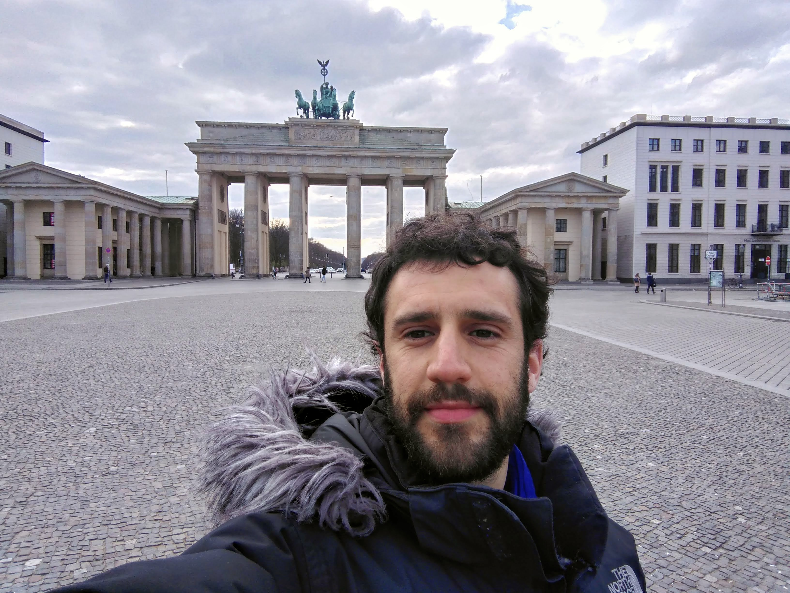
```

I am leaving Europe, this is the end of another epoch, another stage on my life. I was in [Tiergarten](https://en.wikipedia.org/wiki/Tiergarten_(park)), [Belin]( https://en.wikipedia.org/wiki/Berlin), looking at the squirrel, looking at rabbits, at birds, at those sprouts that made me feel a reminiscence of the [psilocybin](https://en.wikipedia.org/wiki/Psilocybin) effects in [Amsterdam](https://en.wikipedia.org/wiki/Amsterdam)^[Something like [this](https://carlitofluito.github.io/letters2019_20/ohm-namae.html)]. I was there, unconsciously remembering that you called me squirrel when I was moving around your body in Leuven. When I thought I was a fox, you were thinking about lizards, because my face loved to be always at the level of your skin when we were together. The gravity of your body gluing my tongue and eyes to your whiteness. 

Today, you don’t talk to me. You don’t want to talk with me. We don’t match anymore. Our vibrations are really foreigners of each other’s. And that’s okay. I don’t know if it was the psychopath, or if it was the psilocybin, or the fact that I am going to leave Europe for a long time, but I don’t care much about you. You were with me at some point of my journey and I am infinitely grateful of how much you made me grow. I am infinitely grateful of how much love I received from you, of how you were when we were together. But seems that this is really over. The last time we have seen each other it was because I was in [Hungary](https://en.wikipedia.org/wiki/Hungary), not because you were in [Spain]( https://en.wikipedia.org/wiki/Spain) or in [Leuven](https://en.wikipedia.org/wiki/Leuven). It felt sort of a complication for you too met me, (although I remember that you came to the center to meet me and then we have to re-arrange the meeting for the next day because of me). You are still a person with a wonderful heart, I have no doubt about that. 

However, you hadn’t really asked me how I was doing, not even once. You have been just annoyed for me, from my communication. You have even been exaggerated, and thinking in polarizing, absolutist terms. It is not “*every time we talk*” that you regret, it is every time you remember that we talked that you regret. You brain, your psyche, your memory is already biased, focused on the negative aspects of our story. You remember that, you are stuck with that, and that’s okay, that’s okay for me. It is not my soul the one that remembers those aspects of our story. My soul is cleaner, or so it seems. At least with our situation. 

It has been a really long journey. A stage of 6 years, since I went to Leuven ready to explore Europe and discovered that I had to explore myself, to arrive to the picture I took two days ago in the [Brandenburg Gate](https://en.wikipedia.org/wiki/Brandenburg_Gate), here in Berlin. To notice that indeed, I am closing chapters. That Europe is pretty much done, and that I am ready to move to the next step. 

Almost by accident, I got most of my hair cut as if I were a monk, or a marine. Again, ready to fight, and ready to pray. Ready to go inside myself, which is probably one of the toughest battles that every human being has to fight. If they want to fight.

 ```{r pelao, fig.cap= "*Berlin (Germany). April, 2020*. Becaming a monk.", fig.margin = TRUE, out.width = "75%", out.height = "75%", fig.align='center', echo=FALSE}
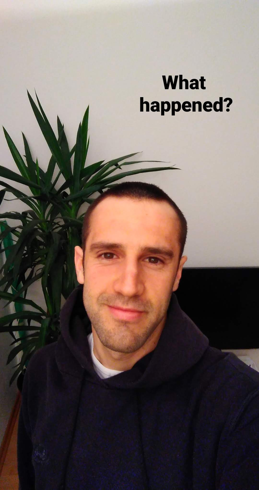
```

I have your letters, [published](https://carlitofluito.github.io/letters2013_14/) and [unpublished]( https://carlitofluito.github.io/letters2014_15/), showing how much I suffer and how I much I loved you. Showing how alive you made me feel. Honestly, it was like you were the perfect person for that moment of my life, one of the best moments of my life. And that is the lesson, when I was at my best, I found you as the best match. A girl that still today, I take you as one of the best. You matched me. However, all that is over today. That is the lesson from the universe. It gives me my needed teacher at the needed time. Then it teaches me to let things go. I have taken some extra time to realize that I also have to let you go.

I sent you “*Goodbye and best wishes*” few days ago. Again goodbye. Just because you couldn’t take a joke as a joke, because you lost your sense of humor, the one you asked me never to lose. I could blame on myself, my inappropriate jokes, and my communicative style. But I don’t think there is nothing wrong with me this time. I am aware of how sensitive you are with blaming and guilt, but that is something you have to work on yourself. Nothing to do with me this time. I learnt that lesson with the psychopath. That was it. Also, because I realize how little you cared about me since our separation. It is true that at the beginning you were there, we were talking, writing and *Skyping*… But little by little you have grown more and more distant. 

You are not my friend anymore. That’s a pity, but that’s a fact. I don’t have pain or hold negative feelings towards you anymore. Most of them went away the second night I spent with the psychopath at [Tallinn](https://en.wikipedia.org/wiki/Tallinn). She cleaned me of myself. She cleaned me of all the rancor and pain I used to hold with my past relationships. She introduced me to a cleaner self^[It was actually me the one that went through the process, but she was the trigger.]. I forgave all the mistakes I committed, and I forgave you for all the things I used to blame you. 

Today, there is only a quiet gratitude, a generalizable love, and the feeling that you are not anymore the origin of that painful melancholy that is embedded in [*Commuting*](https://carlitofluito.github.io/commuting/). You are a person, a consciousness, a life that is doing its own somewhere in this planet, simultaneously. Someone that is already outside of my way, of my path, someone that is gone. Someone that I can welcome again if it happens that enters my life again, but that I accept that we may die without seeing each other. It is like this; it is just this simple. And I am okay with that. 

Our time of being in the same place and in the same time, together or separated, is gone. You may come to Zambia, or to one of my public events, and then, maybe, we see each other again, but it is not going to be me the one looking for you, it is not going to be me the one that seek our encounter again. It is over. I can feel it so clearly. 

My loneliness was bringing me towards you again and again, but I already put my loneliness under control, at the cost of leaving a free place to live, and a job of 2.000€ per month. I already sell my loneliness to a kind of expensive price, if you think in economically materialistic terms. [I bought my love](https://www.youtube.com/watch?v=TXk8BVUnrL8). 

Here in Berlin, I tamed the last remains of loneliness. I discovered that I don’t need other people to carry on with my tasks, with my writings, with my movement routines. I can keep on growing and evolving maintaining my independence. That was a big advance, a huge cleaning session. Just smoking, find myself alone, and getting ready to create, measure my impact, and wake up ready to go through my whole routine step by step. From the fasting, to the writing, to the yoga. Just as a cleaning process. 

Always [take the most independent option](https://www.youtube.com/watch?v=LRVmfx4EWI0). And, this time, the most independent choice was buying an airplane ticket back to Spain yesterday, and leaving Europe as soon as possible. I am ready to buy a land where I am expected to live and maybe die. I am ready to grow my own food, to [build my own dwelling](https://carlitofluito.github.io/letters2019_20/to-c-.html#tea-at-toms-place-future-plans); to stop paying other people in order to sustain my physiological needs and keep my body alive and functioning. It is not [that I am getting out of the system](https://www.youtube.com/watch?v=vxNYkes0qtM), it is that I am already outside, and I am just perfecting how to thrive here. 

I hope you are doing well as well. I hope that all in your life is good. It would be nice to see each other on the future, just to catch up, to know how your life is evolving. But I don’t think any of us needs it. So, it may not happen. It will probably not happen. Anyway, you are always welcome to my life. You are always welcome to ask me how I am doing, how life is evolving. Nevertheless, I am a quite public figure, whether I have audience or not. And that is why, you may probably not need to ask me directly, you just need to type my nickname in your Google search engine. 

Enjoy your life, your existence and the development of your consciousness. 

Thanks for having been in my life, and for your impact on it. 

Infinite love, 

Carlos 

9.24 (Hour and a half of working)


## 2020-04-21 To P. 

2020-04-21
 
18.35
 
Hello P.
 
This is the 8^th^ word file document that is open in the laptop right now. I have a certain degree of numbness in my hands, probably due to the low glucose level in my blood (31) caused by the fasting; or the 30 minutes meditation that I just did where I got a newer and deeper level of sensitivity: fill your lungs of air, and let the weight of your body rest over the air as if you were being held over a balloon as if you pour water over an inflated balloon. The advantage of fasting is that you weight less, so your proprioception is enhanced, you are more aware of your body, and what is going on around and inside it. 
 
I haven’t answered you for so long, because I haven’t used the laptop much. I haven’t started writing as I should and have to, and I am still focused on cleaning up and organizing this house. Also, I keep on being distracted continuously with technology. Definitely, it is a moment for developing and holding a strict routine. I feel it coming. And this fasting experiment is probably the key step towards it. 
 
About the house, I am starting to call this process a “**Karmic Cleaning**”. I am not only ordering and minimalizing this place, which is infinitely full of things but also learning about the educative patterns inherited from my parents. From my father, I can see that I have grown a reactance and extremist attitude in most of his views. He used to complain and still does, about basic survival needs. Things like the amount of food we eat (he complains that we eat a lot and he has to go shopping too often); the amount of money we spend (he is always trying to shop only the most basic and cheapest, and writing down expenses); the length of our showers and how quickly we run out of hot water; the timings when to use electro domestics to adjust to the electricity bills and usage… Those things have had certain logic for me, but considering my extreme personality, I have taken them to a new level that it seems extreme even for him. 
 
About food, it is true that I have always eaten a lot, but going frugivore is being as minimalistic as possible on food, at the expense of increasing significatively the amount of produce that one consumes. Besides, this 10-days fasting experiment that I am currently carrying out, is just the opposite of what he complains. Just stopping eating altogether. 
 
About the money, it is not only that I am also checking and recording my expenses to the tiniest detail, besides my already frugal if not stingy behavior, but I have spent a fair deal of my past developing freegan techniques such as dumpster diving, sneaking into public transport, hitchhiking, low-cost traveling, wearing torn off clothes, couch surfing… I take all of this as advantages, since it has allowed me to develop a pretty cheap lifestyle when I can use the money for a more meaningful purpose. However, it is undeniable that sometimes I go a bit too far. Also, minimalism is probably another manifestation of their frugality with their possessions, and how hyper-functional they are, that they have difficulties throwing away used matches because they can light them up again with the flame of a candle to light up other candles.  
 
About hot water and electricity, I have used cold water for more than 4 years already, and being quite conscious and aware about filling my washing machine to its full capacity, and avoiding leaving my charger plugged once my phone is charged (not very good at this though). 
 
I am not complaining about these inherited patterns, but I can see clearly how my mother and father have unconsciously educated me. Although we are economically at ease, I sense in both of them a strong scarcity mindset. One that has taken me years to get rid of. One that is making me organize this house minimalistic ally, so they can realize how dysfunctionally abundant and opulent they are on their material possessions. That is one of my favorite paradoxes and ironies of minimalism, the less you have, the more abundant you feel. Basically, because one learns how to live with nothing feeling that one has everything. 
 
I am also observing my mother’s ADD. She gets distracted continually, struggles to finish tasks completely (closing the circle, as I say), likes to jump from one task to another a bit randomly, and gets stuck into details for a long time without progressing to the whole body of the task. I have all of these tendencies in my own work, in my writing patterns and my continuous project making and envisioning. That is why I am in so much need of a team to work with. However, being here, and being aware and conscious of this, now I am more confident about how to regress it, how to deconstruct these patterns, and build a strict routine around them to conform a solid identity that allows me to progress and achieve all the things I am in this life. Things that as you know, are not a few, not that easy, and not that common. 
 
About the quarantine, I am doing fine. Quite busy with this endless karmic cleaning, not feeling lonely or isolated because I spend time with my family members and little by little advancing in building a successful identity with high-performing habits. I have a friend that is serving as a reference and inspiration. We are retro alimenting each other. He has no secondary education but is doing an [online university course in sociology](https://www.coursera.org/learn/classical-sociological-theory) at the moment. He gets inspiration and guidance from my intellectual practices and sources of knowledge. Then, he applies them so seriously and diligently that he shows me how fast one person can develop and grow when motivated by curiosity and passion. So much to learn…
 
I recently did a [spiritual activation of five days with Regan Hillyer]( https://www.youtube.com/watch?v=Sb6Z2Z2jSUY). It has some parts that are quite weird and wu-wu at the beginning, but letting it be, with acceptance and an open-mind are always good attitudes to try it out. The first two days were the deepest for me, I had a clear vision of what I am going to do and when, and I got in touch with my numerous blockages. After that, I have struggled a bit with developing and deepening on the practice. However, I feel that this fasting is the very begging of a huge swift. I am even looking forward to future fasting with higher levels of social isolation in a cell completely dark or things like this. Just meditate, a bit of stretch and going deep and deep in the practice of fasting. It is an endless path inside. 
 
Actually, I am not arguing with my family much anymore. I used to struggle a lot at the beginning but on the second day of the activation, I developed the clear intention of “*Not losing my cool*”, and since then, I barely got any angry or frustrated. I think I am going to repeat that day with different intentions to get rid of more blockages and bad patterns. 
 
As you know my pushing personality, I am able to negotiate, but when I know that a certain lifestyle brings more wellbeing individually or to the world, I insist quite stubbornly, especially in the people that I feel they have the potential to change. In the case of my family, they accept me as no one does, and that is why I can move forward towards the change so fast and so directly, even though there are still certain areas of friction. 
 
About the sentence of your swami: 
 
> “*Wanting to control everything, and furthermore, wanting others to be and behave as I want is not love.*”
 
I disagree and agree. It is true that wanting to control is not love, since love is based on trust and freedom, and psychopaths are those that crave control over others. However, when one has experienced different lifestyles and has found a way out of the self-destructing ones, wanting to change people towards the better seems to me, the correct and moral choice. Knowing how to make that change without suffering in any of the parts, student and teacher, is wisdom. The wisdom that I still lack. Taoism seems the best pedagogical strategy so far. Anyways, I agree that I can come across as too imposing, or fast changer for many people and that brings problems more often that I would like to. I have downloaded a book on nonviolent communication. I will keep you posted. 
 
About us working together. I approach our differences in style and form as an advantage due to we could complement and learn from each other. Don’t fear me, P. Since fear is the opposite of love and you are a huge sage on this… vibrational state?
 
My personal professional projects are still on stand-by until the cleaning up is done (at least my room). I have already done two bathrooms, the kitchen, and two inner balconies (*galleria* in Spanish). Still missing the living room, and my brother’s room which is full of all the extra stuff from other rooms. I planned to use that space as working out, dance, stretching room, but now is a warehouse room where nothing can be done. 
 
Call me when you want to. Home or phone since I haven't got rid of it, yet… (Hopefully soon). 
 
Love, 
 
Carlos

